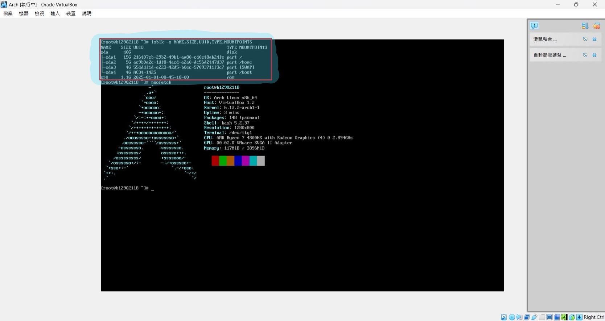

# NASA 2025 - HW0 - Anthony Ching (B12902118)
## Network Administration
### 1. Short Answer (10pt)
#### References
- https://en.wikipedia.org/wiki/Internet_protocol_suite
- https://en.wikipedia.org/wiki/Physical_layer
- https://en.wikipedia.org/wiki/VLAN
- https://en.wikipedia.org/wiki/Network_switch
- https://en.wikipedia.org/wiki/Router_(computing)
- https://en.wikipedia.org/wiki/Broadcast_storm
- https://en.wikipedia.org/wiki/Switching_loop
- https://en.wikipedia.org/wiki/Transmission_Control_Protocol
- https://en.wikipedia.org/wiki/User_Datagram_Protocol
- https://www.webcomm.com.tw/blog/efk/?srsltid=AfmBOoq9J63gpk7VJwqH6NWiWh1ZFyvv2lu4Kqmojj9aQE4dcmk4vfU8
- https://en.wikipedia.org/wiki/Multiplexing
- https://chatgpt.com/
- https://vocus.cc/article/5edd062efd8978000114b5e2
#### 1.
- Application Layer: It is used to provide user services or exchanging application data over the network connections established by the lower-level protocols. An example of application layer application is transferring files using the FTP protocol.
- Transport Layer: It is used to establish host-to-host basic data channels that applications use for task-specific data exchange. An example of transport layer application is using TCP to establish a connection.
- Network (Internet) Layer: It does routing, which sends data from the source network to the destination network. An example of network layer application is using IPv4 to define IP addresses.
- Link Layer: It is used to move packets between the network (internet) layer interfaces of two different hosts on the same link. An example of link layer application is using ARP to discover the MAC addresses.
- Physical Layer: It provides an electrical, mechanical, and procedural interface to the transmission medium and actually transmits the data. Examples of transmission medium are optical fibers, copper cables, ethernet cables, and Wi-Fi.
#### 2.(a)
VLAN is any broadcast domain that is partitioned and isolated in a computer network at the data link layer (OSI layer 2).
#### 2.(b)
A switch is a multiport networking device that uses MAC addresses to forward data at the data link layer (layer 2) of the OSI model. A router is also a networking device but it forwards data packets between computer networks, including internetworks such as the global Internet. In TCP/IP, a router will help send a data packet to the right IP address, while a switch will then help send a data packet to the right MAC address after it has arrived at the right IP address.
#### 2.(c)
Broadcast storm is when broadcast and multicast traffic on a computer network accumulates and consumes sufficient network resources so as to render the network unable to transport normal traffic. Switching loop is a layer 2 network topology where there exists more than one path between two switches. A switching loop is a possible cause of a broadcast storm. Broadcast storms could also be caused by smurf attacks and fraggle attacks. To prevent a broadcast storm, routers can filter broadcasts, physically segmenting the broadcast domains, or establish firewalls. Switching loops can be prevented with link aggregation, shortest path bridging or spanning tree protocol. In Metro Ethernet rings it is prevented using the Ethernet Ring Protection Switching (ERPS) or Ethernet Automatic Protection System (EAPS) protocols.
#### 3.
IPv4 is changing to IPv6 because IPv4 addresses were running out. It is possible that IPv6 will be changed to another. It could be due to that humans have conquered the universe and needed more IP addresses, or other reasons than running out of IP addresses. IPv6 uses 128-bit address space, while IPv4 uses 32-bit address space. The reason why IPv4 and IPv6 are both existing is because there are old systems and applications still using IPv4. It takes some time to fully switch to IPv6.
#### 4.
TCP works by first establishing a connection by three-way-handshaking, then transmitting data, finally closing connection by four-way-handshaking. On the other hand, UDP does not establish a connection before transmitting data. It directly transmits data. The similarities between these two protocols are that they are both transport layer protocols, and they both have source port, destination port, and checksum fields in their headers. The differences between them are that TCP is reliable, but UDP isn't, and TCP provides congestion control but UDP doesn't, etc. When an application needs data to be reliably transferred, TCP is more preferred. When an application needs data to be efficiently but not reliably transferred, UDP is more preferred.
#### 5.
EFK是Elasticsearch、Fluentd、 Kibana的縮寫，是一種日誌分析和可視化系統，用於收集、分析和搜索日誌數據，Elasticsearch是一個分散式搜索和分析引擎，它用於儲存和索引日誌數據，Fluentd是一個數據收集和日誌處理系統，用於將日誌從各種搜集的來源轉到Elasticsearch，Kibana是一個可視化工具，用於在Elasticsearch中查找和可視化數據。

EFK的優點是Elasticsearch支持全文檢索與即時分析，便於快速查找問題，還有Kibana提供直觀的儀表板，有助於課程或研究中的數據分析，所以EFK適合系上使用。

EFK的缺點是Elasticsearch需要較多記憶體與 CPU，可能影響系統運行效能，還有大量日誌存入 Elasticsearch，可能佔用大量磁碟空間。
#### 6.
Multiplexing is a method by which multiple analog or digital signals are combined into one signal over a shared medium. This increases the efficiency of the medium which data is sent over.

Examples:
1. FDM (Frequency Division Multiplexing) splits frequency bandwidth into sections. Each user sends data in a different frequency range.
2. TDM (Time Division Multiplexing) splits time into sections. Each user sends data in a different time section.
3. Statistical Multiplexing allocates medium dynamically. Each user contends for the medium to send data under some rule.

I think our department's Wi-Fi employs statistical multiplexing becuase there are a lot of students and faculty members who might access the Wi-Fi at any time. It is a reasonable choice to use statistical multiplexing to increase medium usage efficiency. It also uses FDM (OFDM), as it is a common technique for modern Wi-Fi to reduce interference.
<div style="page-break-after: always"></div>

### 2. Command Line Utilities (14pt)
#### References
- https://www.geeksforgeeks.org/how-to-get-an-ip-address-from-domain-name/
- https://www.varonis.com/blog/what-is-traceroute?fbclid=IwZXh0bgNhZW0CMTEAAR1KgOOZrQz8eCFQTzNFbAz3daR0ofCy2_tYyuSg-eh5u1VETOE1XoQC5mk_aem_TKkSvplElsdkndvHIXGzyQ
- https://serverfault.com/questions/413124/dns-nslookup-what-is-the-meaning-of-the-non-authoritative-answer
- https://www.ibm.com/docs/en/aix/7.1?topic=p-ping-command
- https://stackoverflow.com/questions/4797534/how-to-manually-send-http-post-requests-from-firefox-or-chrome-browser
- https://docs.netapp.com/us-en/e-series-santricity/sm-hardware/what-are-icmp-ping-responses.html
- https://linux.die.net/man/1/nmap
- https://chatgpt.com/
#### 1.(a)
Command: `traceroute speed.ntu.edu.tw`

Result:


#### 1.(b)
Command: `ping speed.ntu.edu.tw`

Result:


Command: `nslookup speed.ntu.edu.tw` 

Result:


#### 1.(c)
`10.200.200.200` belongs to a private network.
`140.112.4.126` and `140.112.5.178` belong to the public network.
This is because `10.200.200.200` starts with `10.`, while the other two starts with `140.`. The following IP ranges are reserved for private use:
- 10.0.0.0 – 10.255.255.255 (10.0.0.0/8)
- 172.16.0.0 – 172.31.255.255 (172.16.0.0/12)
- 192.168.0.0 – 192.168.255.255 (192.168.0.0/16)
#### 1.(d)
It means the round-trip time for each traceroute packet to the corresponding destination of the row. The results from more below might not be larger than above beacuase the packets are sent at different time, and the network traffic might change from time to time.
#### 1.(e)

#### 2.(a)(1)
ICMP echo request, ICMP echo reply
#### 2.(a)(2)

#### 2.(b)


The server is found to be up by `nmap`, while `ping` did not find it to be up. `nmap` sends an ICMP echo request, a TCP SYN packet to port 443, a TCP ACK packet to port 80, and an ICMP timestamp request. TCP SYN packet and TCP ACK packet helped find the host.
#### 2.(c)(1)
The service is `http`, and the version is `nginx 1.26.2`. It is a HTTP (web) server.
#### 2.(c)(2)

#### 2.(d)


Then execute this shell script:
```
#!/bin/bash

IP="140.112.91.2"

# Loop through the port range 48000 to 49000
for PORT in $(seq 48000 49000); do
  echo "Curling $IP:$PORT"
  # Perform the curl request
  curl -i -X POST "$IP:$PORT"
  echo -e "\n" # Print a newline for better readability
done

echo "Done curling all ports."
```

We can see that port 48763 might be listening, so we execute `nc 140.112.91.2 48763`:


#### 3.(a)
Execute `nslookup Bocchi-Tracker.csie.ntu.edu.tw`, and we can see that the IP is `140.112.30.131`.
#### 3.(b)
Execute `nslookup 140.112.30.131`, and we can see that the domain name is `Starry.csie.ntu.edu.tw`.
#### 3.(c)
Execute `nslookup -type=txt Starry.csie.ntu.edu.tw` and we can see that `Your guitar is in the box`.
#### 3.(d)
Execute `dig Bocchi.csie.ntu.edu.tw` and we can see that the CNAME is `Gu1tArHer0.csie.ntu.edu.tw`.
<div style="page-break-after: always"></div>

### 3. Basic Wireshark (11pt)
#### References
- https://www.wireshark.org/docs/wsug_html_chunked/ChStatIOGraphs.html
- https://my.f5.com/manage/s/article/K19310681
#### 1.(a)
By inspecting packet No.5, we can see that there's a GET request packet sent from `::1`, port `58649` to `::1`, port `3000`. Thus the server is localhost and the port is `3000`.
#### 1.(b)
Since a GET request is sent from the client to the server, `localhost:3000` is the server.
#### 1.(c)

#### 1.(d)
1.268e+06 (bytes/sec), happening at 2s
#### 1.(e)
29, type `http.request.method=="GET"` in the top filter bar, and we can see that there are 29 packets displayed at the bottom bar.
#### 1.(f)
Click `Find a packet` and then find a packet with String `invoice`. We can see that there's a packet:
`969	32.100430	::1	::1	HTTP	577	POST /dashboard/invoices/create HTTP/1.1`. In there, we can find under `Content-Disposition: form-data; name="1_customerId"\r\n\r\n`, there is `Data: 33393538646339652d373132662d343337372d383565392d666563346236613634343261`, which is the customer ID value.
#### 2.(a)
Go to `Wireshark > Preferences`, under `Protocols > TLS`, click `edit` next to `RSA key list` and add the `p2_private.key` file to decrypt:


#### 2.(b)
After some inspection, we can see that it is packet 32. We can click `File > Export Objects > HTTP`, and choose `apache_pb.png`.


<div style="page-break-after: always"></div>

### 4. Cryptography (5pt)
#### References
- https://chatgpt.com/
- https://en.wikipedia.org/wiki/RSA_(cryptosystem)
#### Flag
NASA_HW0{1_10V3_r54}
#### Code and Solving Process
1. Generate 2 prime numbers with 2048 bits p, q
2. Calculate n = p * q
3. Calculate λ(n) = lcm(p-1, q-1)
4. Let e = 65537, and calculate d where e * d ≡ 1 (mod λ(n))
5. Write (n, e) to a file `4.in` and execute the command `nc 140.112.91.1 48763 < 4.in`
6. Let the output be c, and calculate m = pow(c, d, n)
7. Convert m from long to bytes and then decode to get the final message

`4.py`
```
from Crypto.Util.number import getPrime
import math

p = getPrime(2048)
q = getPrime(2048)
print(p, q)
n = p * q
lambdan = math.lcm(p-1, q-1)
e = 65537

def extended_gcd(a, b):
    old_r, r = a, b
    old_s, s = 1, 0
    old_t, t = 0, 1
    
    while r != 0:
        quotient = old_r // r
        old_r, r = r, old_r - quotient * r
        old_s, s = s, old_s - quotient * s
        old_t, t = t, old_t - quotient * t
    
    return old_r, old_s, old_t  # old_r is the gcd, old_s is the inverse of a mod b

# Calculate d: modular inverse of e modulo λ(n)
g, d, _ = extended_gcd(e, lambdan)

if g != 1:
    raise ValueError("e and λ(n) are not coprime, no modular inverse exists.")
else:
    # Ensure d is positive by adjusting it if necessary
    d = d % lambdan

print("n:", n)
print("e:", e)
print("d:", d)
```

`decrypt4.py`
```
from Crypto.Util.number import long_to_bytes

c = 412240423825486049951048973553689885353604943254959766073091016654006511669764151505983401914200086103590329140719185418866900222998960870550486073512697643527773825982172860630141574457931309904112650730292452609506207420275411393372760266263687056902330158860368208642275247887733915844571068209449515181548965504842576227838407067278595154321915872045826426727482285607749501239787988034685173996484628631051452410240353479426424512823209685968036645385866099294293673589491742650103574172280082989941705797844719777646868886606539454482569738686542804033238928229337815125852150148108144705217644431031419905053828615210329621198302449310037865646990828416814085203963772732440421663212108217157109901251575923227554239879868001714260964080561090269673370590944389645572549516619784451869824516213474283997678848389657465492644583289168461929704038760533623059884722800444861552786188441378230221423881212907206222735309819074014809662776342361556934195512194760299770623946158092451780128185708848287488353116841999835712841546456572667841157610508081138088136036430972920948715338314656074468819587404147572235655228059267981276150981537907938517980323184868919468056592093949041678601244607092023367657923706048188330135700886
d = 28771575168319688319766216831385539718938323660636539222417441598984153023679085506268224031847829164665460318348781731100425664003861998623459241322128347067760581260298295586179332193258283534929914971848518582514981498619273352022954006445356698688384230477262255540364422623917574401053266062447219462930777543107776121191277170767144917772813578302519801049841819276893591075154914646647689109706499978232254275716562153982664872732939389475818507933842047603364847548717756878288892661686681638858520107884377218163736630371405710696558398350694396836260383613745553068403858299419415554589260958018614053268089784418716276410789734377128349887972418167288112550748823290195367481884001581387131902322852329779688913233987743057660047063053456562791012822777688360789404969435917548880568207839318794373059817809504036124650439602579065311056072366543875071251191177269184966310953481762019558790847718204831722918136825965033702662172093221648210820285949347360849527677196207408833687933239033286119462134040431743784754956384760856311889995868955632584929481290536307733714564349876163001287123188969047335121968372143615099626737180023291029343609484502612280409358867831372996252560187829446121140993898087642148643011983
n = 720566609186485222627546736823838271406940036079410306739534502288755278025421142662620443936772631029111625839229644600138308416720375952023048837091265071694729716854787363033476171180014570293115790399351517359002996933320674226429528076075157746108134760634992589522525889626273259100118934310401919091304133944075278130506107358983393341599980949447388141419075209203149587271802168472332820017642782908123271817452264398023784891777077422359104854898492939474576911203228698502930701879737617183314756630947747180484099437482000915325271416868782377730589170458203545548939683345920732641659663233806474444569495214393967214004979657706200248385745100912816945271531524179846425435402592527412368862567473014790685662109502617502083259722329931246748581156906965112801951407981725710312611693864086707015938669212698895733001107258763063041526598119128520642786046286507289969280867881041643593216022356654867653837155456200211820715948611684805144266660777893158497416638922758085789242732552450818127707110975316743404443006590219986177108238294157228994564679306572292040142961220934658051032854841114208457335790215294609496074714537713319519899130393404891310805605852821371281943806129720340983320169805910146449570663009
m = pow(c, d, n)

msg = long_to_bytes(m)

print("Decrypted message:", msg.decode())
```
<div style="page-break-after: always"></div>

### 5. 為什麼簽不了憑證？？？(10pt)
#### References
- https://chatgpt.com/
- https://en.wikipedia.org/wiki/Default_gateway
- Computer Networking, A Top Down Approach, 7th
#### 1
A subnet is a smaller, distinct network within a larger network.
#### 2
A gateway serves as the entry point to another network, facilitating communication between networks.
#### 3
`X->WAN->A1`
#### 4
If A has a route specification that points to X through A1, then `A1->WAN->X`. Otherwise, `A2->LAN->B2->B->WAN->X`.
#### 5
A stateful firewall tracks connection states for more intelligent filtering, while a stateless firewall filters packets based only on predefined rules without context.

A stateful firewall might have a better chance of blocking TCP ACK without SYN.
#### 6
B is a firewall that blocks the [SYN, ACK] packet sent by A from A2 because B has never seen a TCP SYN packet sent from X before. Thus X does not receive a [SYN, ACK] packet from A, and therefore does not send a further ACK back at A.
#### 7
It will take two or more hours according to previous experiences:


- Shutting down the system might take about 10 minutes.
- Changing the certificate might take about 30 minutes to an hour. Testing the system might take another 30 minutes to an hour.
- Starting the server and more testing might take another 30 minutes to an hour.
#### 8
Configure the routing table for A to X to always send packets from A1 instead of A2.
#### 9
Yes.
<div style="page-break-after: always"></div>

## System Administration
### 6. btw I use arch (15pt)
#### References
- https://chatgpt.com/
- https://wiki.archlinux.org/title/Installation_guide#Verify_the_boot_mode
- https://hackmd.io/@PIFOPlfSS3W_CehLxS3hBQ/r1xrYth9V
#### 6-0
1. Download `archlinux-2025.01.01-x86_64.iso`
2. Open up VirtualBox and select `archlinux-2025.01.01-x86_64.iso` file and set corresponding settings
3. Start up the virtual machine
4. Execute `fdisk -l` to see the disk partition name
5. Execute `cfdisk` and partition the disks
6. Execute `mkfs.ext4 /dev/sda1`, `mkfs.ext4 /dev/sda2`, `mkswap /dev/sda3`, `mkfs.fat -F 32 /dev/sda4` to format the disk partitions
7. Mount `/dev/sda1` to `/mnt`
8. Create `/mnt/home` and `/mnt/boot` directories and mount `/dev/sda2` to `/mnt/home`, `/dev/sda4` to `/mnt/boot`
9. Execute `swapon /dev/sda3`
10. Execute `pacstrap -K /mnt base linux linux-firmware`
11. Execute `genfstab -U /mnt >> /mnt/etc/fstab`
12. Execute `arch-chroot /mnt`
13. Execute `echo "b12902118" > /etc/hostname`
14. Execute `passwd` and set the root password
15. Execute `pacman -S grub efibootmgr`
16. Execute `grub-install --target=x86_64-efi --efi-directory=/boot --bootloader-id=GRUB`
17. Execute `grub-mkconfig -o /boot/grub/grub.cfg`
18. Execute `exit`
19. Execute `reboot`
20. Log in as `root`
21. Execute `useradd -m nasa` to add a user
22. Execute `passwd nasa` to set the password
23. Execute `su - nasa` to switch user to nasa
#### 6-1

#### 6-2

#### 6-3

<div style="page-break-after: always"></div>

### 7. Flag Hunting (25pt)
#### References
- https://chatgpt.com/
- https://askubuntu.com/questions/850055/ctrl-b-c-n-w-etc-not-working-in-tmux-console
#### 1.(a)
`/home/nasa/kickstart.nvim/.git/logs/refs/remotes/origin/HEAD`

By executing `echo $HISTFILE`, we can find its location.
#### 1.(b)
Execute `grep -E "HISTSIZE|HISTFILESIZE" ~/.bashrc ~/.bash_profile /etc/profile /etc/bash.bashrc 2>/dev/null`

Then we can find in `/home/nasa/.bashrc`, the limit of bash history cached is set at `HISTSIZE=1000`. With `export HISTSIZE=<number>`, we can set the variable.
#### 1.(c)
Execute `grep -E "HISTSIZE|HISTFILESIZE" ~/.bashrc ~/.bash_profile /etc/profile /etc/bash.bashrc 2>/dev/null`

Then we can find in `/home/nasa/.bashrc`, the limit of bash history stored is set at `HISTFILESIZE=2000`. With `export HISTFILESIZE=<number>`, we can set the variable.
#### 1.(d)
Execute `cat /home/nasa/.bash_history`, then we can find a command `.gen_flag --line 104 --out new_history_file`, implying that the flag is on line 104.
Then execute `history | less`, and we can find on line 104: `NASA{y0UF1nd+heCoRr3tFL4G}`, which is the flag.
#### 2
After executing `treasure`, the hint says the flag is at the start of line 27.
Go to the `treasure-chest` directory and execute `ls -lS | grep '^-' | tail -1`. The smallest file is `flag-139`.
Then execute `cat flag-139 | head -27 | tail -1` to find the flag: `NASA{EZ_TrEa$Ur3_HunT!}`
#### 3
write a shell script:
```
setsid ./a &
sleep 1
pkill -P $!
```
And execute it to get the flag: `NASA{m0dERn_Pr0B1em$_reQU1r3_m0dERn_SOluT10N5}`
#### 4
Execute `strings chal | grep '486' | grep 're02'` to find the pass code. Then execute `./chal [passcode]` to get the flag: `NASA2025{n4ndeharuh1ka93yatt4no}` (なんで春日影やったの)
#### 5
1. Execute `tmux`

2. Execute `tmux split-window`

3. Execute `tmux split-window -h`

4. Execute `tmux split-window`

5. Execute `tmux split-window -h`

6. Execute `tmux split-window`

7. Execute `tmux split-window -h`

<div style="page-break-after: always"></div>

### 8. NASA 國的大危機 (10pt)
#### References
- https://chatgpt.com/
#### 8-1
By executing `cat mystic-cup Dockerfile`, we can see that the docker file wrote:
```
FROM python:3.9-slim
RUN apt-get update && apt-get install -y \
	build-essential \
	libssl-dev \
	net-tools \
	iproute2 \
	tcpdump \
	tshark \
	nano \
	curl \
	wget \
	vim \
	less \
	procps \
	lsof \
	iputils-ping \
	&& rm -rf /var/lib/apt/lists/*

RUN mkdir -p /usr/libexec/run

COPY usr/libexec/run/dist/transfer /usr/libexec/run/transfer
COPY usr/libexec/run/run.sh /usr/libexec/run/run.sh

RUN chmod +x /usr/libexec/run/transfer
RUN chmod +x /usr/libexec/run/run.sh

CMD ["/usr/libexec/run/run.sh"]
```
This creates a lightweight Python-based container with additional networking and debugging tools installed.

`FROM python:3.9-slim`

Uses the official Python 3.9 slim image as the base.
```
RUN apt-get update && apt-get install -y \
	build-essential \
	libssl-dev \
	net-tools \
	iproute2 \
	tcpdump \
	tshark \
	nano \
	curl \
	wget \
	vim \
	less \
	procps \
	lsof \
	iputils-ping \
	&& rm -rf /var/lib/apt/lists/*
```
Updates the package list (apt-get update).

Installs:
- Development tools (build-essential, libssl-dev).
- Networking tools (net-tools, iproute2, tcpdump, tshark, iputils-ping).
- Text editors (nano, vim, less).
- File and process management tools (procps, lsof).
- Download utilities (curl, wget).

Cleanup: Removes cached package lists (`rm -rf /var/lib/apt/lists/*`) to reduce image size.

`RUN mkdir -p /usr/libexec/run` ensures that the `/usr/libexec/run` directory exists.

```
COPY usr/libexec/run/dist/transfer /usr/libexec/run/transfer
COPY usr/libexec/run/run.sh /usr/libexec/run/run.sh
```
Copies the `transfer` binary (or script) and the `run.sh` script into the container.

```
RUN chmod +x /usr/libexec/run/transfer
RUN chmod +x /usr/libexec/run/run.sh
```
Grants execution permissions to both files.

`CMD ["/usr/libexec/run/run.sh"]`

Specifies that when the container starts, it will execute `/usr/libexec/run/run.sh`.
#### 8-2
Execute `cat mystic-cup/usr/libexec/run/run.sh`:


We can see that we need to start docker with the environmental variable `MAGIC_SPELL` set to `hahahaiLoveNASA`

Execute `docker images`:


We can see that the docker id is `3cddc4add21e`

Execute `docker run -e MAGIC_SPELL=hahahaiLoveNASA 3cddc4add21e` to start the docker with `MAGIC_SPELL` set to `hahahaiLoveNASA`:


#### 8-3
With the docker still running, on a Mac environment, press `option + right arrow` to open another command line window in the vnc viewer. Then execute `docker ps` to see the container ID.

Then execute `docker exec -it a766a168cef8 /bin/bash` to enter the container.

Then execute `tcpdump -i any -X` to capture the packet sent and acquire the flag.

Flag: `flag[I'll send our killer on 3948/02/22]`