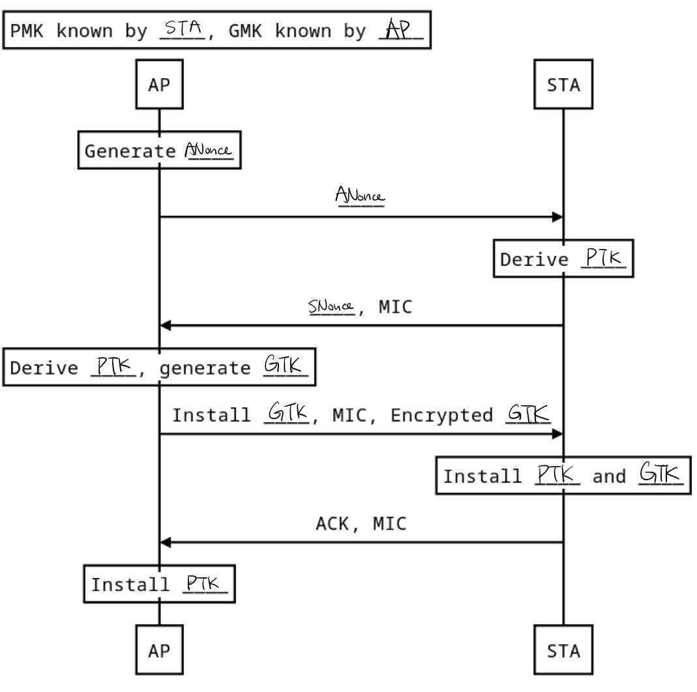
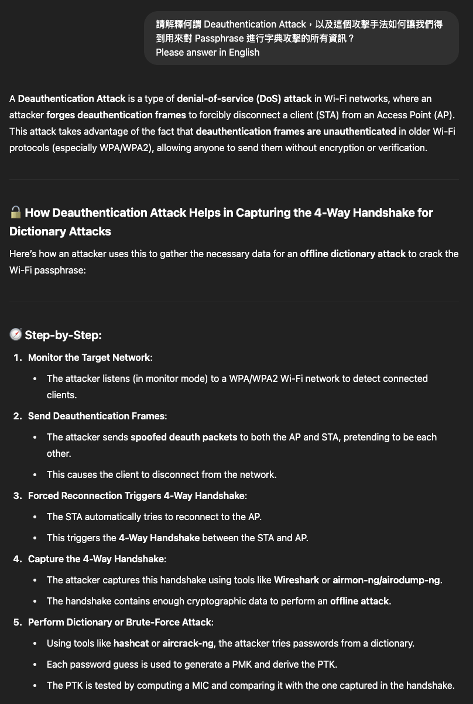

# NASA HW10 - 金哲安(B12902118)
<style>
  code {
    white-space : pre-wrap !important;
    word-break: break-word;
  }
</style>
## A. Miscs
### References
- B12902116 (林靖昀)
- B12902066 (宋和峻)
- https://note-on-clouds.blogspot.com/2018/11/wifi-bss-ess-ssid-essid-bssid.html
- https://zh.wikipedia.org/zh-tw/%E6%9C%8D%E5%8A%A1%E9%9B%86
- https://blog.csdn.net/reekyli/article/details/108765419
- https://www.cnblogs.com/lizhuming/p/15487113.html
- https://documentation.meraki.com/MR/Wi-Fi_Basics_and_Best_Practices/Multi-SSID_Deployment_Considerations
### 1
SSID (Service Set Indentifier) is the network name of the wireless network. BSSID (Basic Service Set Indentifier) is a 48-bit label  of a BSS, usually the MAC address of the Wi-Fi AP. A wireless network can contain multiple APs. This network will have one SSID, which is the name of the network, while each AP will have its own BSSID, which is its MAC address.
### 2
Firstly, a single AP can have multiple SSIDs. For example, there could be a "guest SSID" and an "internal SSID". Clients that connect with different SSIDs will have different encryption and bandwidth limits.
Secondly, different APs can also have the same SSID. For example, in classroom 204, there are two APs sharing the same SSID "csie". This is used to increase Wi-Fi coverage of the wireless network.
<div style=page-break-after: always></div>

## B. HTML's Wi-Fi Problem
### References
- B12902116 (林靖昀)
- B12902066 (宋和峻)
- https://en.wikipedia.org/wiki/Signal-to-interference-plus-noise_ratio
### 1
By Friis transmission equation, $P_r \propto G_t \times G_r \times P_t \times \lambda^2 \times d^{-2}$.
Thus $P_r \propto f^{-2}$ when $d$, $P_t$, $G_t$, $G_r$ are fixed.
Therefore 2.4GHz has a stronger receiving signal.
### 2
Since $G_t = G_r = 0$ (dB), $G_t = G_r = 10^{\frac{0}{10}} = 1$.
Thus $\frac{P_r}{P_t} = 1 \times 1 \times (\frac{3 \times 10^8}{4 \times \pi \times 5 \times 10^9 \times 1})^2 = (\frac{3}{200 \times \pi})^2$, and $10\log{(\frac{3}{200 \times \pi})^2} \approx -46.42117227$.
Therefore $\frac{P_r}{P_t} \approx -46.42117227$ (dB)
### 3
Since the noise can be ignored, SINR = $\frac{P}{I}$, where $P$ is the power of the incoming signal of interest, $I$ is the interference power of the other (interfering) signals in the network.
$$\text{SINR}_{before} = \frac{\frac{1}{(0-(-5))^2+(10-(-10))^2}}{\frac{1}{(20-(-5))^2+(0-(-10))^2}} = \frac{29}{17} \lt \text{SINR}_{after} = \frac{\frac{1}{(0-(-5))^2+(-10-(-10))^2}}{\frac{1}{(20-(-5))^2+(0-(-10))^2}+\frac{1}{(0-(-5))^2+(10-(-10))^2}} = \frac{493}{46}$$
Therefore the new AP does improve the professor's connection quality.
<div style=page-break-after: always></div>

## 3
### References
- B12902116 (林靖昀)
- B12902066 (宋和峻)
- https://wiki.archlinux.org/title/Software_access_point#Wireless_client_and_software_AP_with_a_single_Wi-Fi_device
- https://moda.gov.tw/press/multimedia/blog/11728#toTop
- https://en.wikipedia.org/wiki/IEEE_802.11g-2003
- https://wireless.docs.kernel.org/en/latest/en/users/documentation/hostapd.html
- https://en.wikipedia.org/wiki/Wired_Equivalent_Privacy
- https://ecenetworking.byu.edu/526/labs/wep-wpa-security/
- https://publish.obsidian.md/addielamarr/ARP+Request+Replay+Attacks
- https://www.aircrack-ng.org/doku.php?id=arp-request_reinjection
- https://www.aircrack-ng.org/doku.php?id=install_aircrack#compiling_on_macos
- https://www.aircrack-ng.org/downloads.html
- https://wiki.wireshark.org/HowToDecrypt802.11
- https://networklessons.com/wireless/wpa-and-wpa2-4-way-handshake
- https://en.wikipedia.org/wiki/Wi-Fi_deauthentication_attack
- https://nordvpn.com/blog/deauthentication-attack/
- https://www.baeldung.com/cs/deauthentication-attacks
### 1
```
# /etc/hostapd/hostapd.conf

interface=wlan0
driver=nl80211
bridge=br0

ssid=tiaosu
hw_mode=g
channel=6
country_code=TW

macaddr_acl=0 
auth_algs=2
wpa=0
wep_key0=xxxxxxxxx
wep_tx_keyidx=0
```
### 2
**Open System Authentication**: The client first sends an authentication request, and then the AP grants access. Then the client asks for association, and then the AP answers OK. Then it's connected.
**Shared Key Authentication**: 
1. The client sends an authentication request to the access point.
2. The access point replies with a clear-text challenge.
3. The client encrypts the challenge-text using the configured WEP key and sends it back in another authentication request.
4. The access point decrypts the response. If this matches the challenge text, the access point sends back a positive reply.
### 3
#### (a)
Open System Authentication
#### (b)
The attacker used ARP to collect IVs, this attack is called ARP Request Replay Attack.
#### \(c)
Firstly, look at the packets captured to find out the MAC address of the AP: `2c:cf:67:57:78:33`. Then execute:
```
aircrack-ng -b 2c:cf:67:57:78:33 WEPCapture.cap
```
Result
```
KEY FOUND! [ 63:73:6C:3C:33 ] (ASCII: csl<3 )
```
#### (d)
Server IP: 140.112.30.188
Port: 54321
Account: tiaosu
Password: ilovecsl
Flag: NASA_HW10{W3P_15_N07_50_54F3}
### 4
I disagree. Because even if the WEP key is leaked and the frame is decrypted, the resulting packet is still encrypted by https. The account and password is still protected by https. 
### 5
{width=75%}
### 6
A deauthentication attack is where an attacker sends spoofed deauthentication packets to the AP and STA to force them to disconnect, and then the attacker captures new handshake packets between AP and STA. The attacker then tries all passwords from a dictionary, generating PMKs and deriving PTKs. The PTKs are then used to compute MICs to compare with the MICs captured in the new handshake packets. If the MICs match, then the password is breached.

(Chat with LLM)

### 7
#### (a)
Client MAC address: ba:e0:e8:e8:4f:41
AP MAC address: 2c:cf:67:57:78:33
#### (b)
21
#### \(c)
4
#### (d)
```
aircrack-ng DeAuthCapture.cap -w rocktiaosu.txt
```
Result
```
KEY FOUND! [ felwinter ]
```
Passphrase: felwinter
#### (e)
192.168.0.81

