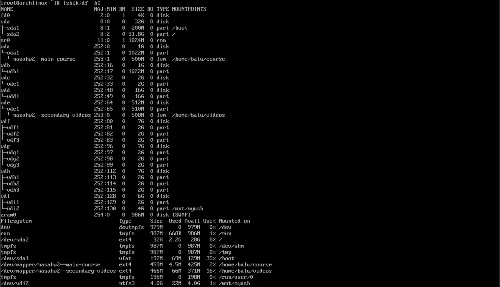
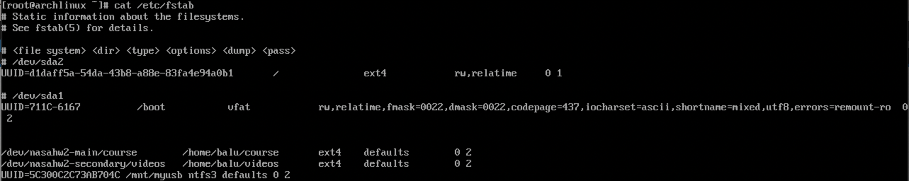
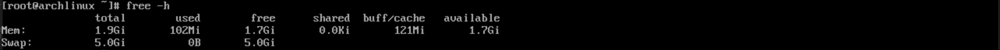
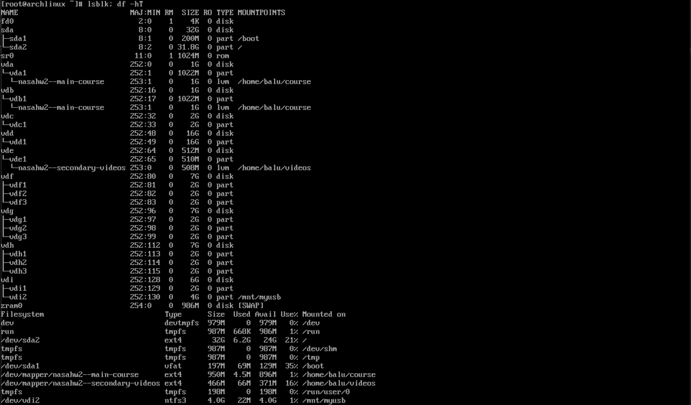
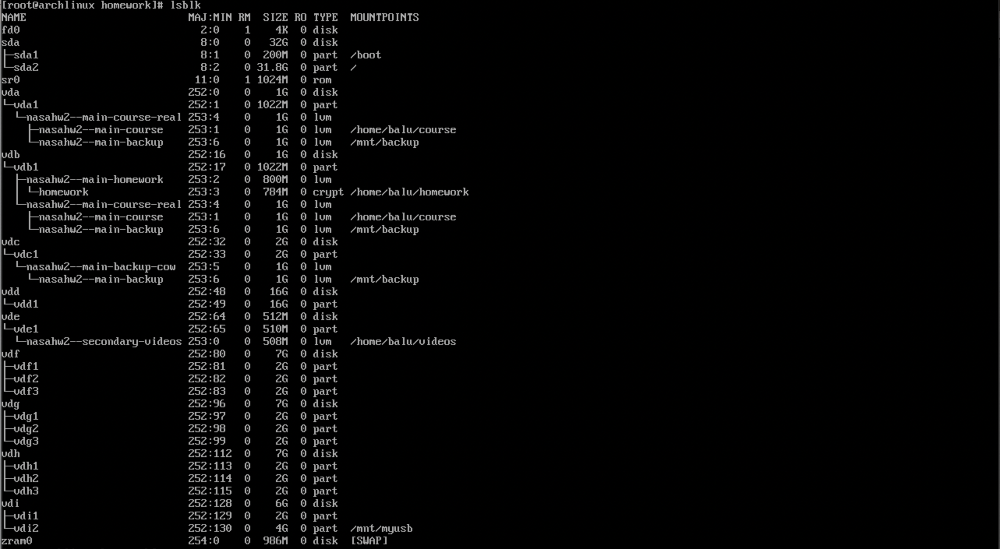
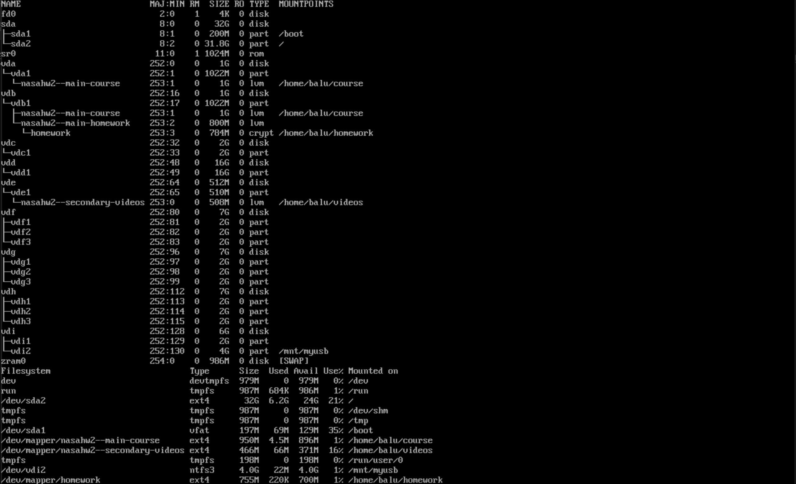
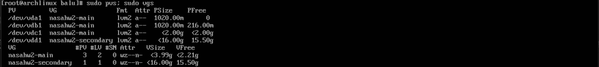
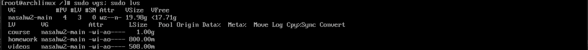
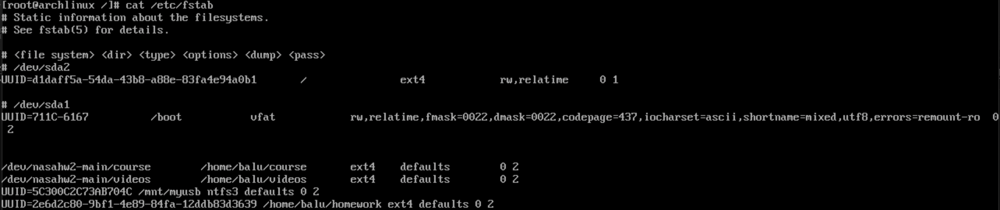

# NASA HW2 - 金哲安(B12902118)

## 1.

### References

- https://www.lijyyh.com/2016/11/windows-linux-os-x.html?m=1
- https://bbs.archlinux.org/viewtopic.php?id=293546
- 宋和峻（B12902066）
- 林靖昀（B12902116）

### Steps

1. Execute `sudo pacman -S ntfs-3g`
2. Execute `mkfs.ntfs -Q /dev/vdi2`
3. Execute `mkdir /mnt/myusb`
4. Execute `mount -t ntfs3 /dev/vdi2 /mnt/myusb`
5. Execute `lsblk -f` to see the UUID
6. `vim /etc/fstab` to add an entry to enable auto mount on startup

### Screenshots

## 2. 

### References

- https://wiki.archlinux.org/title/Swap
- 宋和峻（B12902066）

### Steps

1. Execute `sudo fallocate -l 4G /newswap`
2. Execute `sudo chmod 600 /swapfile`
3. Execute `sudo mkswap -U clear /newswap`
4. Execute `sudo swapon /newswap`

### Screenshot

## 3.

### References

- https://hackmd.io/@Mqvhsb9VRYSU2scAkRqGIQ/S147zK8dJx#/6/7
- 宋和峻（B12902066）

### Steps

1. Execute `vgdisplay` to see the volume group information
2. Execute `lvresize -L 1G --resizefs nasahw2-main/course` to resize

### Screenshot

## 4.

### References

* https://osslab.tw/books/linux-administration/page/%E5%8A%A0%E5%AF%86%E4%BD%A0%E7%9A%84%E9%9A%A8%E8%BA%AB%E7%A2%9F---cryptsetup
* https://stackoverflow.com/questions/40026555/how-do-i-make-cryptsetup-automatically-use-a-key-file-during-mount-time
* 林靖昀（B12902116）

### Steps

1. `lvcreate -L 800M -n homework nasahw2-main`
2. `sudo cryptsetup luksFormat /dev/nasahw2-main/homework`
3. Enter a passphrase
4. `cryptsetup luksOpen /dev/nasahw2-main/homework homework`
5. `mkfs.ext4 /dev/mapper/homework`
6. `cryptsetup luksAddKey /dev/nasahw2-main/homework /home/balu/lvm_key`
7. `echo "homework UUID=$(cryptsetup luksUUID /dev/nasahw2-main/homework) /home/balu/lvm_key" >>/etc/crypttab`
8. `lsblk -f` to get the UUID
9. Add an entry to `/etc/fstab`
10. `mount /dev/mapper/homework /home/balu/homework`

### Screenshot

## 5.

### References

- https://github.com/facebook/zstd/issues/1526
-  林靖昀（B12902116）

### Steps

1. `vgextend nasahw2-main /dev/vdc1`
2. `lvcreate --size 1G --snapshot --name backup /dev/nasahw2-main/course`
3. `mkdir /mnt/backup`
4. `mount /dev/nasahw2-main/backup /mnt/backup`
5. `lsblk`

6. `cd /home/balu`
7. `tar --zstd -cf backup.tar.zst /mnt/backup`
8. `umount /mnt/backup`
9. `lvremove /dev/nasahw2-main/backup`
10. type `y` to confirm

### Screenshot

## 6.

### References

- https://wiki.archlinux.org/title/LVM

### Steps

1. `pvcreate /dev/vdd1`
2. `vgextend nasahw2-secondary /dev/vdd1`
3. `pvmove /dev/vde1 /dev/vdd1`
4. `vgreduce nasahw2-secondary /dev/vde1`
5. `pvremove /dev/vde1`

### Screenshot

## 7.

### References

### Steps

`umount /dev/nasahw2-secondary/videos`
`vgchange -a n nasahw2-secondary`
`vgsplit nasahw2-secondary nasahw2-main /dev/vdd1`
`vgchange -a y nasahw2-main`
`vim /etc/fstab` to change `/dev/nasahw2-secondary` to `/dev/nasahw2-main`
`mount -a`

### Screenshots

## 8.

### References

- https://www.youtube.com/watch?v=rBGhTluGNyA
- https://www.osslab.com.tw/btrfs-vs-zfs-snapshot/
- https://www.youtube.com/watch?v=HdEozE2gN9I
- https://blog.purestorage.com/purely-educational/btrfs-vs-zfs/
- https://zh.wikipedia.org/zh-tw/Btrfs
- https://zh.wikipedia.org/wiki/ZFS
- https://en.wikipedia.org/wiki/Filesystem_in_Userspace
- https://unix.stackexchange.com/questions/4146/what-are-the-benefits-and-downsides-to-use-fusefs-filesystems
- https://en.wikipedia.org/wiki/NTFS-3G
- https://en.wikipedia.org/wiki/GUID_Partition_Table
- https://en.wikipedia.org/wiki/Master_boot_record
- https://en.wikipedia.org/wiki/Megabyte
- https://en.wikipedia.org/wiki/Byte#Multiple-byte_units
- https://superuser.com/questions/554124/what-is-the-default-size-unit-in-linux-ls-l-command
- https://man7.org/linux/man-pages/man1/ls.1.html
- https://en.wikipedia.org/wiki/RAID
- https://en.wikipedia.org/wiki/Standard_RAID_levels#RAID_5

### 1

Btrfs and ZFS are all Copy-on-Write filesystems that support snapshots, file compression, and RAID. Btrfs is natively supported on Linux and uses the GPL license, while ZFS is supported on FreeBSD and Sun Solaris and uses the CDDL license.

### 2

FUSE (Filesystem in Userspace) is a software interface for Unix and Unix-like computer operating systems that lets non-privileged users create their own file systems without editing kernel code. This is achieved by running file system code in user space while the FUSE module provides only a bridge to the actual kernel interfaces.  
Pro: FUSE allows non-privileged users to create and mount their own filesystems without modifying kernel code, enhancing system stability and security.  
Con: FUSE filesystems can experience performance limitations due to the context switching between user space and kernel space, leading to higher CPU usage, especially on embedded or older systems. 

### 3

GPT is GUID Partition Table, and MBR is Master Boot Record.  
GPT supports more than 4 primary partitions while MBR supports up to 4.  
GPT uses 64-bit addressing while MBR uses 32-bit.

### 4

1 MB = 1,000,000 = $10^6$ Bytes  
1 MiB = 1,048,576 = $2^{20}$ Bytes  
The default unit is KiB or MiB (base 2)

### 5

RAID 0 consists of block-level striping, but no mirroring or parity. It stores contents of each file across all drives.  
RAID 1 consists of data mirroring, without parity or striping. Data is written identically to two or more drives, thereby producing a "mirrored set" of drives.  
RAID 5 consists of block-level striping with distributed parity. It stores contents of each file and their parity blocks across all drives.  
RAID 10 is RAID 1+0. It uses striping in RAID 0 and uses data mirroring in RAID 1. RAID 10 is a stripe of mirrors.
