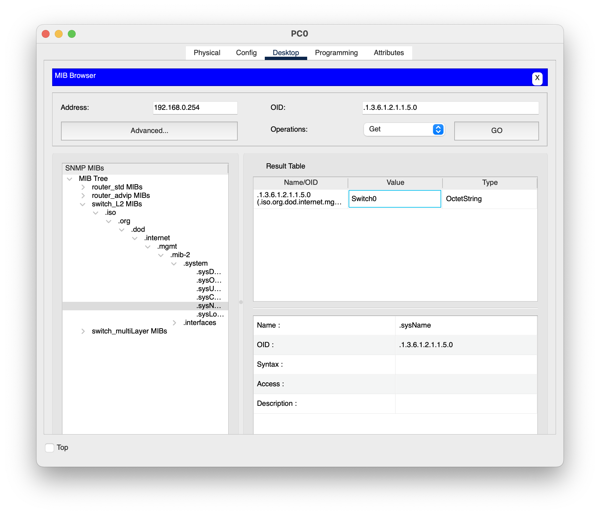

# NASA HW2 - 金哲安(B12902118)
## 1 問答題 (30%)
### References
- https://www.uuu.com.tw/Public/content/article/16/160822tips.htm
- https://www.cisco.com/c/en/us/td/docs/switches/lan/catalyst4500/12-2/25ew/configuration/guide/conf/dynarp.html
- https://www.cisco.com/en/US/docs/switches/lan/catalyst3850/software/release/3se/consolidated_guide/b_consolidated_3850_3se_cg_chapter_0111101.html
- https://en.wikipedia.org/wiki/IEEE_802.1Q
- https://community.cisco.com/t5/switching/vlan-tagging-on-access-port/td-p/4056567
- https://networkdirection.net/articles/network-theory/taggeduntaggedandnativevlans/#Untagged_VLANs
- https://documentation.meraki.com/%E6%97%A5%E6%9C%AC%E8%AA%9E/General_Administration/Tools_and_Troubleshooting/Fundamentals_of_802.1Q_VLAN_Tagging
- https://www.networkacademy.io/ccna/ethernet/trunk-native-vlan
- https://www.jannet.hk/vlan-trunking-protocol-vtp-zh-hant/#google_vignette
- https://superuser.com/questions/1406097/why-link-aggregation-does-not-have-a-positive-impact-on-the-maximum-transfer-spe
- https://www.reddit.com/r/synology/comments/jydpxj/link_aggregation_doesnt_even_nearly_double_my/?rdt=42972
- https://docs.google.com/presentation/d/1boEemQXZ2kGQbWOqNlZl2_a-JTh79grZdfEiM_z4j_0/edit#slide=id.g21c8677d3c6_0_97
- https://www.cisco.com/c/en/us/td/docs/switches/datacenter/nexus5500/sw/interfaces/7x/b_5500_Interfaces_Config_Guide_Release_7x/configuring_port_channels.pdf
- https://www.cisco.com/c/en/us/tech/lan-switching/spanning-tree-protocol/index.html
- https://www.cisco.com/c/en/us/td/docs/routers/access/3200/software/wireless/SpanningTree.html
- https://www.jannet.hk/spanning-tree-protocol-stp-zh-hant/
### 1.1
DAI prevents ARP poisoning attacks by intercepting all ARP requests and responses. Each of these intercepted packets is verified for valid MAC address to IP address bindings before the local ARP cache is updated or the packet is forwarded to the appropriate destination. Invalid ARP packets are dropped.

DAI determines the validity of an ARP packet based on valid MAC address to IP address bindings stored in a trusted database. This database is built at runtime by DHCP snooping. In addition, DAI can also validate ARP packets against user-configured ARP ACLs (ARP access control lists) in order to handle hosts that use statically configured IP addresses.

DAI can also be configured to drop ARP packets when the IP addresses in the packet are invalid or when the MAC addresses in the body of the ARP packet do not match the addresses specified in the Ethernet header.
### 1.2(a)
Frames going out from an access port will not have the 802.1Q tag.

Frames going out from a trunk port will have the 802.1Q tag, except maybe for frames that belong to the native vlan.

This is because frames going out from an access port will arrive at the destination(s) of the desired vlan, but frames going out from a trunk port will still have to be forwarded to get to the destination(s) of the desired vlan.
### 1.2(b)
Trunk Native is a deafault vlan, the native vlan, that untagged frames will be assigned to.

This might be used when there are frames coming from a trunk port that are untagged. The switch will then tag the frame with the native vlan.

For example, if there is an old switch that does not support 802.1Q tagging sending frames to other switches through a trunk port, the latter switch can still forward the packet to a default vlan. This can be useful when we want to setup vlans but have restricted equipments. 
### 1.2(c)
VTP lets switches to be configured in one of three modes: Server, Client, or Transparent.

- Server mode can create, modify, and delete vlans and propagate changes to clients.
- Client mode receives vlan updates from VTP servers but cannot create vlans.
- Transparent mode does not participate in VTP but forwards advertisements.

Advantages:
- Simplifies VLAN management by automatically propagating VLAN configurations.
- Reduces administrative overhead in large networks.

Disadvantages:
- A misconfiguration (e.g., adding a switch with a higher revision number) can overwrite VLAN configurations, leading to network issues.
- VTP is Cisco-proprietary and does not work with non-Cisco devices.
### 1.3(a)
This is because a single connection will use a single port and therefore only utilize a single link of the aggregated links, limiting the maximum throughput to a single link's maximum.
### 1.3(b)
Active Mode: LACP mode that places a port into an active negotiating state, in which the port initiates negotiations with other ports by sending LACP packets.

Passive Mode: LACP mode that places a port into a passive negotiating state, in which the port responds to LACP packets that it receives but does not initiate LACP negotiation.
### 1.3(c)
A port in passive mode cannot form a port channel with another port that is also in passive mode because neither port will initiate negotiation.
### 1.4(a)
Spanning-Tree Protocol implements the 802.1D IEEE algorithm by exchanging BPDU messages with other switches to detect loops, and then removes the loop by shutting down selected bridge interfaces. This algorithm guarantees that there is one and only one active path between two network devices.

STP will first elect a root switch, and then select root ports, and then select designated ports and non-designsted ports. Non-designated ports will block all traffic.
### 1.4(b)
- Disabled: Port is administratively shut down.
- Blocking: Port does not forward traffic but listens for BPDUs.
- Listening: Port prepares to forward traffic but does not learn MAC addresses, it participates in electing root switch, selecting root ports, and selecting designated and non-designated ports.
- Learning: Port learns MAC addresses but does not forward traffic yet.
- Forwarding: Port actively forwards traffic and learns MAC addresses.

## 2 真好，又有新的 switch 可以玩了：）(30%)
### References
- https://www.cisco.com/c/en/us/support/docs/switches/catalyst-6000-series-switches/10581-6.html
- https://www.cisco.com/c/en/us/support/docs/security-vpn/secure-shell-ssh/4145-ssh.html
- https://www.practicalnetworking.net/stand-alone/configuring-vlans/
- https://www.oreilly.com/library/view/hardening-cisco-routers/0596001665/ch04.html
- https://www.cisco.com/c/en/us/support/docs/smb/switches/cisco-350-series-managed-switches/smb5557-configure-the-internet-protocol-ip-address-settings-on-a-swi.html
- https://community.cisco.com/t5/routing/how-to-shut-vty-5-15/td-p/894152
- https://topic.alibabacloud.com/tc/a/differences-between-login-and-login-local-in-cisco-commands_8_8_30208876.html
- 林靖昀（B12902116）
### 2.1
`Switch(config)#hostname Switch1`
`Switch(config)#hostname Switch2`
### 2.2
`Switch1(config)#enable secret enable`
`Switch2(config)#enable secret enable`
### 2.3
`Switch1(config)#ip ssh version 2`
`Switch1(config)#ip domain-name nasa.com`
`Switch2(config)#ip ssh version 2`
`Switch2(config)#ip domain-name nasa.com`
### 2.4
`Switch1(config)#line vty 0 4`
`Switch1(config-line)#login local`
`Switch1(config-line)#transport input ssh`
`Switch1(config)#line vty 5 15`
`Switch1(config-line)#no exec`
`Switch2(config)#line vty 0 4`
`Switch2(config-line)#login local`
`Switch2(config-line)#transport input ssh`
`Switch2(config)#line vty 5 15`
`Switch2(config-line)#no exec`
### 2.5
`Switch1(config)#vlan 10`
`Switch1(config-vlan)#name VLAN10`
`Switch1(config)#vlan 20`
`Switch1(config-vlan)#name VLAN20`
`Switch1(config)#vlan 99`
`Switch1(config-vlan)#name VLAN99`
`Switch2(config)#vlan 10`
`Switch2(config-vlan)#name VLAN10`
`Switch2(config)#vlan 20`
`Switch2(config-vlan)#name VLAN20`
`Switch2(config)#vlan 99`
`Switch2(config-vlan)#name VLAN99`
### 2.6
`Switch1(config)#interface Fa0/1`
`Switch1(config-if)#switchport mode access`
`Switch1(config-if)#switchport access vlan 10`
`Switch1(config)#interface Fa0/2`
`Switch1(config-if)#switchport mode access`
`Switch1(config-if)#switchport access vlan 20`
`Switch1(config)#interface Fa0/3`
`Switch1(config-if)#switchport mode access`
`Switch1(config-if)#switchport access vlan 99`
`Switch2(config)#interface Fa0/4`
`Switch2(config-if)#switchport mode access`
`Switch2(config-if)#switchport access vlan 10`
`Switch2(config)#interface Fa0/5`
`Switch2(config-if)#switchport mode access`
`Switch2(config-if)#switchport access vlan 20`
### 2.7
`Switch1(config)#interface range Gig0/1-2`
`Switch1(config-if-range)#channel-group 1 mode active`
`Switch1(config)# interface port-channel 1`
`Switch1(config-if)# switchport mode trunk`
`Switch1(config-if)# switchport trunk allowed vlan 10,20,99`
`Switch2(config)#interface range Gig0/1-2`
`Switch2(config-if-range)#channel-group 1 mode active`
`Switch2(config)# interface port-channel 1`
`Switch2(config-if)# switchport mode trunk`
`Switch2(config-if)# switchport trunk allowed vlan 10,20,99`
### 2.8
`Switch1(config)#username admin privilege 15 secret nasa2025`
`Switch1(config)#line vty 0 4`
`Switch1(config-line)#privilege level 15`
`Switch1(config)#interface vlan 99`
`Switch1(config-if)#ip address 192.168.99.1 255.255.255.0`
`Switch2(config)#username admin privilege 15 secret nasa2025`
`Switch2(config)#line vty 0 4`
`Switch2(config-line)#privilege level 15`
`Switch2(config)#interface vlan 99`
`Switch2(config-if)#ip address 192.168.99.2 255.255.255.0`

## 3 你在 switch 上玩什麼！(40%)
### References
- https://en.wikipedia.org/wiki/Simple_Network_Management_Protocol
- https://en.wikipedia.org/wiki/Management_information_base
### 3.1
Simple Network Management Protocol (SNMP) is an Internet Standard protocol for collecting and organizing information about managed devices on IP networks and for modifying that information to change device behavior.

The main difference between SNMPv3 and SNMPv2 is security. SNMPv2 uses a community string (unencrypted) for authentication, while SNMPv3 supports MD5/SHA authentication. SNMPv2 provides no encryption and integrity checks for messages, while SNMPv3 does.
### 3.2
A Management Information Base (MIB) is a database used for managing the entities in a communication network. It comprises a collection of information organized hierarchically and defines the properties of the managed resources and the services they support. Each entry in a MIB is identified by an object identifier (OID), which is a unique sequence used to reference specific managed objects.

In the context of the Simple Network Management Protocol (SNMP), the MIB serves as a standardized framework that both SNMP managers and agents utilize to exchange information about network devices. It defines the structure and organization of the data that can be queried or modified, ensuring consistent communication across diverse devices and systems. By referencing the OIDs defined in the MIB, SNMP managers can perform operations such as retrieving the current status of a device or configuring its settings. This structured approach facilitates effective network management and monitoring.
### 3.3
Monitoring these objects in the IF-MIB best reflects the abnormality:
- ifInOctets: The total number of octets received on the interface, including framing characters.
- ifOutOctets: The total number of octets transmitted out of the interface, including framing characters.
- ifSpeed: An estimate of the interface's current bandwidth in bits per second. Max 4,294,967,295
- ifHighSpeed: An estimate of the interface's current bandwidth in units of 1,000,000 bits per second.
- ifOutDiscards: The number of outbound packets which were chosen to be discarded even though no errors had been detected to prevent their being transmitted. One possible reason for discarding such a packet could be to free up buffer space.
- ifInDiscards: The number of inbound packets which were chosen to be discarded even though no errors had been detected to prevent their being deliverable to a higher-layer protocol. One possible reason for discarding such a packet could be to free up buffer space.

I can see the traffic on the switch with ifInOctets, ifOutOctets, ifSpeed, and ifHighSpeed. And I can see packets dropped by the switches from in ifInDiscards and ifOutDiscards. 
### 3.4
`Switch0(config)#snmp-server rabhunter public RO`

