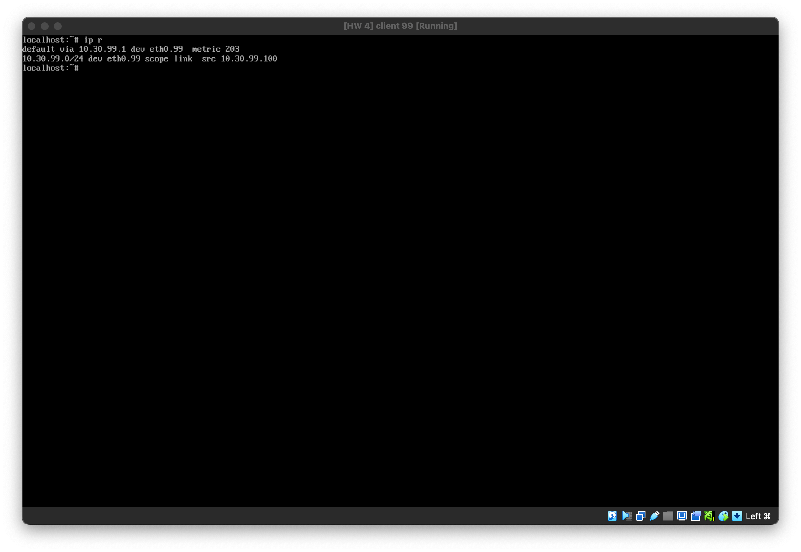
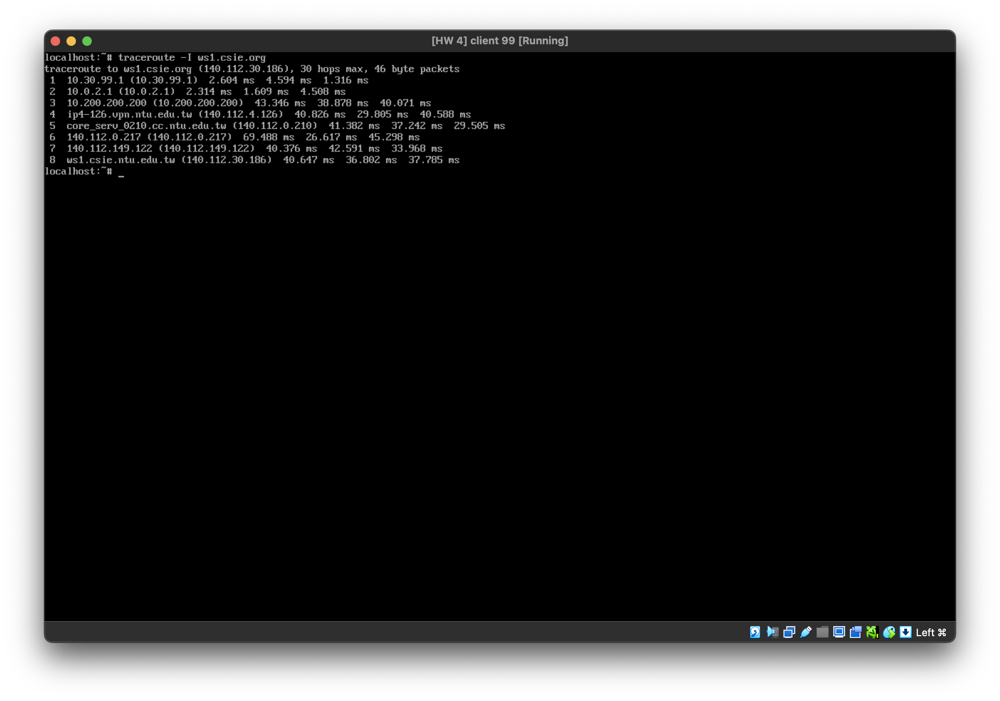
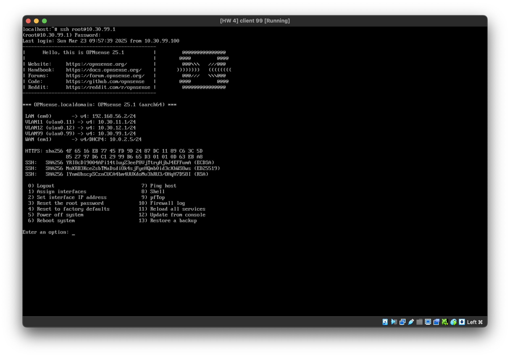

# NASA HW4 - 金哲安(B12902118)
## Short Answers (15 pt)
### 1.
Block –> deny traffic and don’t let the client know it has been dropped (which is usually advisable for untrusted networks)

Reject –> deny traffic and let the client know about it. (only tcp and udp support rejecting packets, which in case of TCP means a `RST` is returned, for UDP `ICMP UNREACHABLE` is returned).

For internal networks it can be practical to use reject, so the client does not have to wait for a time-out when access is not allowed. When receiving packets from untrusted networks, you usually don’t want to communicate back if traffic is not allowed.
### 2.
Traffic can be matched on in[coming] or out[going] direction, our default is to filter on incoming direction. In which case you would set the policy on the interface where the traffic originates from.

In visual terms: [Source] -> IN -> [Firewall] -> OUT -> [Destination]. 

For example, if you want to allow https traffic coming from any host on the internet, you would usually set a policy on the WAN interface allowing port 443 to the host in question.

If you want to block https traffic going out to a client on the local area net, you can set a policy on the LAN interface to the client in question blocking port 443.
### 3.
Interface net: 

All networks assigned to the physical interface, this will include networks of virtual addresses assigned as well ([Interface] is explained in the interfaces topic). Normally used to allow traffic from or to clients connected to a specific interface.

Interface address: 

All addresses configured on an interface, this includes all virtual (alias) addresses as well.
### References
- https://docs.opnsense.org/manual/firewall.html
- https://docs.opnsense.org/manual/firewall_generic.html

## OPNsense (85 pt)
### 1.
1. On macOS, download `OPNsense-25.1-ufs-efi-vm-aarch64.qcow2.bz2` from https://github.com/maurice-w/opnsense-vm-images/releases
2. `bunzip2 OPNsense-25.1-ufs-efi-vm-aarch64.qcow2.bz2`
3. `qemu-img convert -f qcow2 -O vdi OPNsense-25.1-ufs-efi-vm-aarch64.qcow2 OPNsense.vdi`
4. On VirtualBox, create a new virtual machine and start it with the settings:
	- Name and Operating System
		- Name: `OPN1`
		- ISO Image: \<not selected\>
		- Type: BSD
		- Subtype: FreeBSD
		- Version: FreeBSD (ARM 64-Bit)
	- Hardware
		- Base Memory: 4096 MB
		- Processors: 8
	- Hard Disk
		- Use an Existing Hard Disk File
			- `OPNsense.vdi`
5. Login to the virtual machine with:
	- Username: `root`
	- Password: `opnsense`
6. Type `3`
7. Type `y`
8. `b12902118`
9. `b12902118`
### 2.
1. On VirtualBox `Tools` > `Network` > `Host-only Networks`, create a Host-only Network if none exist with settings:
	- Name: `HostNetwork`
	- Mask: `255.255.255.0`
	- Lower Bound: `192.168.56.1`
	- Upper Bound: `192.168.56.199`

	This will simulate LAN.
2. On VirtualBox `Tools` > `Network` > `NAT Networks`, create a NAT Network if none exist with settings:
	- Name: `NatNetwork`
	- IPv4 Prefix: `10.0.2.0/24`
	- Enable DHCP

	This will simulate WAN
3. Shut down the virtual machine and then on VirtualBox, select machine `OPN1` > `Settings` > `Network`. Set `Adapter 1` > `Attached to:` to `Host-only Network`. Select `Adapter 2`, create a new interface by selecting `Enable Network Adapter` > `Attached to:` to `NAT Network`.
4. Start the virtual machine again
5. Login to the virtual machine with:
	- Username: `root`
	- Password: `b12902118`
6. Type `2`
7. Press `Enter`
8. `192.168.56.2`
9. `24`
10. Press `Enter`
11. Press `Enter`
12. Press `Enter`
13. Press `Enter`
14. Press `Enter`
15. Press `Enter`
16. Press `Enter`
17. On Google Chrome, connect to `https://192.168.56.2` and login with username: `root`, password: `opnsense`
18. Wait until the page refreshes
19. Click `Next`
20. Click `Next`
21. Click `Next`
22. Uncheck `Block private networks from entering via WAN` and `Block non-Internet routed networks from entering via WAN`
23. Click `Next`
24. Click `Next`
25. Click `Next`
26. Click `Reload`
27. Go to `Interfaces` > `Devices` > `VLAN` and click the plus sign
28. Add a new VLAN with the following configurations:
	- Device: `vlan0.11`
	- VLAN tag: `11`
	- Description: `VLAN 11`
29. Click the plus sign again and add a new VLAN with the following configurations:
	- Device: `vlan0.12`
	- VLAN tag: `12`
	- Description: `VLAN 12`
30. Click the plus sign again and add a new VLAN with the following configurations:
	- Device: `vlan0.99`
	- VLAN tag: `99`
	- Description: `VLAN 99`
31. Click `Apply`
32. Go to `Assignments`
33. Assign a new interface with the following settings:
	- Device: `vlan0.11 VLAN11 (Parent: em0, Tag:11)`
	- Description: `VLAN 11`
34. Assign a new interface with the following settings:
	- Device: `vlan0.12 VLAN12 (Parent: em0, Tag:12)`
	- Description: `VLAN 12`
35. Assign a new interface with the following settings:
	- Device: `vlan0.99 VLAN99 (Parent: em0, Tag:99)`
	- Description: `VLAN 99`
36. Change WAN interface device to `em1` and click save
37. Go to `Interfaces` > `[VLAN11]` and click `Enable Interface`
38. Select `Static IPv4` for IPv4 Configuration Type
39. Type `10.30.11.1` and `24` for IPv4 Address and click `Save`
40. Click `Apply changes`
41. Go to `Interfaces` > `[VLAN12]` and click `Enable Interface`
42. Select `Static IPv4` for IPv4 Configuration Type
43. Type `10.30.12.1` and `24` for IPv4 Address and click `Save`
44. Click `Apply changes`
45. Go to `Interfaces` > `[VLAN99]` and click `Enable Interface`
46. Select `Static IPv4` for IPv4 Configuration Type
47. Type `10.30.99.1` and `24` for IPv4 Address and click `Save`
48. Click `Apply changes`
49. Go to `Interfaces` > `[WAN]` and click `Enable Interface`
50. Select `DHCP` for IPv4 Configuration Type
51. Select `DHCPv6` for IPv6 Configuration Type and click `Save`
52. Click `Apply changes`
VM interfaces:
- WAN: `NAT Network`
	- IP and subnet: assigned by DHCP, `10.0.2.5/24`
- LAN: `Host-only Network`
	- IP and subnet: `192.168.56.2/24`
### 3.
1. Go to `Services` > `ISC DHCPv4` > `[VLAN11]`
2. Check `Enable DHCP server on the VLAN11 interface`
3. Set Range: `10.30.11.100` - `10.30.11.199`
4. Set DNS servers: `8.8.8.8`, `8.8.4.4`
5. Click `Save`
6. Go to `Services` > `ISC DHCPv4` > `[VLAN12]`
7. Check `Enable DHCP server on the VLAN12 interface`
8. Set Range: `10.30.12.100` - `10.30.12.199`
9. Set DNS servers: `8.8.8.8`, `8.8.4.4`
10. Click `Save`
11. Go to `Services` > `ISC DHCPv4` > `[VLAN99]`
12. Check `Enable DHCP server on the VLAN1199 interface`
13. Set Range: `10.30.99.100` - `10.30.99.199`
14. Set DNS servers: `8.8.8.8`, `8.8.4.4`
15. Click `Save`
16. Go to `Firewall` > `Rules` > `[VLAN11]` and click the plus sign to add a rule with the following settings:
	- Action: `Pass`
	- Interface: `VLAN11`
	- Direction: `In`
	- Protocol: `UDP`
	- Source: `any`
	- Destination: `VLAN11 net`
	- Destination Port:
		- From: `(other)` > `67`
		- To: `(other)` > `68`
	- Description: `Allow DHCP for VLAN11`
17. Click Save & Apply Changes.
18. Repeat the same steps 17 and 18 but for `[VLAN12]` and `[VLAN99]`
19. Repeat the same steps 17 and 18 but for blocking `[LAN]` and `[WAN]`
### 4.
1. Go to `Firewall` > `Aliases`
2. Click the plus sign
3. Type `ADMIN_PORTS` for Name
4. Type `22,80,443,` for Content
5. Click `Save`
6. Click the plus sign
7. Type `CSIE_WS` for Name
8. Type `ws1.csie.org,ws2.csie.org,ws3.csie.org,ws4.csie.org,ws5.csie.org,ws6.csie.org,ws7.csie.org,` for Content
9. Click `Save`
10. Click the plus sign
11. Type `GOOGLE_DNS` for Name
12. Type `8.8.8.8,8.8.4.4,` for Content
13. Click `Save`
14. Click `Apply`
### 5.
1. Go to `System` > `Settings` > `Administration`
2. At `Secure Shell`, check `Enable Secure Shell`
3. Check `Permit root user login`
4. Check `Permit password login`
5. Click `Save`
6. Go to `Firewall` > `Rules` > `VLAN99`
7. Add a new rule:
	- Action: `Pass`
	- Interface: `VLAN99`
	- Protocol: `TCP`
	- Source: `VLAN99 net`
	- Destination: `This Firewall`
	- Destination Port Range: `SSH`
	- Description: `Allow SSH to OPNsense`
8. Add a new rule:
	- Action: `Pass`
	- Interface: `VLAN99`
	- Protocol: `any`
	- Source: `VLAN99 net`
	- Destination: `This Firewall, GOOGLE_DNS, CSIE_WS`
9. Click `Apply Changes`

Screenshots:

### 6.
1. Go to `Firewall` > `Rules` > `[VLAN11]`
2. Add a new rule:
	- Action: `Block`
	- TCP/IP Version: `IPv4+IPv6`
	- Interface: `VLAN11`
	- Protocol: `any`
	- Source: `VLAN11 net`
	- Destination: `This Firewall, VLAN99 net`
	- Description: `Block VLAN11 to firewall and VLAN99`
3. Go to `Firewall` > `Rules` > `[VLAN12]`
4. Add a new rule:
	- Action: `Block`
	- TCP/IP Version: `IPv4+IPv6`
	- Interface: `VLAN12`
	- Protocol: `any`
	- Source: `VLAN12 net`
	- Destination: `This Firewall, VLAN99 net, VLAN11 net`
	- Description: `Block VLAN12 to firewall, VLAN99, and VLAN11`
5. Go to `Firewall` > `Aliases`
6. Click the plus sign to create a new alias:
	- Name: `BlockedWebsites`
	- Type: `URL Table (IPs)`
	- Content: `https://www.csie.ntu.edu.tw/~euom/colorful_websites.txt`
	- Update Frequency: `1` Day `0` Hours
7. Click `Save` and `Apply`
8. Go to `Firewall` > `Rules` > `[VLAN11]`
9. Click the plus sign to create a new rule:
	- Action: `Block`
	- TCP/IP Version: `IPv4+IPv6`
	- Interface: `VLAN11`
	- Protocol: `any`
	- Source: `VLAN11 net`
	- Destination: `BlockedWebsites`
10. Click `Save` and `Apply Changes`.
11. Repeat the steps 8, 9, 10 but for `VLAN12`
12. Go to `System` > `Settings` > `Cron`
13. Click the plus sign and configure:
	- Minute: `0`
	- Hour: `2`
	- Day of the Month: `*`
	- Month: `*`
	- Day of the Week: `*`
	- Command: `Update and reload firewall aliases`
	- Description: `Update and reload firewall aliases`
14. Click `Save` and `Apply`
15. Go to `Firewall` > `Settings` > `Schedules`
16. Click the plus sign to create a new schedule:
	- Name: `Schedule1`
	- Month: `Mon`
	- Time: `9``00` - `12``00`
17. Click `Add Time` and `Save`
18. Go to `Firewall` > `Rules` > `[VLAN11]`
19. Click the plus sign to create a new rule:
	- Action: `Block`
	- TCP/IP Version: `IPv4+IPv6`
	- Interface: `VLAN11`
	- Protocol: `any`
	- Source: `VLAN11 net`
	- Destination: `any`
	- Schedule: `Schedule1`
20. Click the plus sign to create a new rule:
	- Action: `Pass`
	- TCP/IP Version: `IPv4+IPv6`
	- Interface: `VLAN11`
	- Protocol: `any`
	- Source: `VLAN11 net`
	- Destination: `any`
21. Click `Save` and `Apply Changes`.
22. Repeat the steps 18, 19, 20, 21 but for `VLAN12`
### References
b12902066 (宋和峻)
### 7.
1. Go to `System` > `Configuration` > `Backups`
2. Click `Donwload configuration`
3. Rename the configuration file to `b12902118.xml`