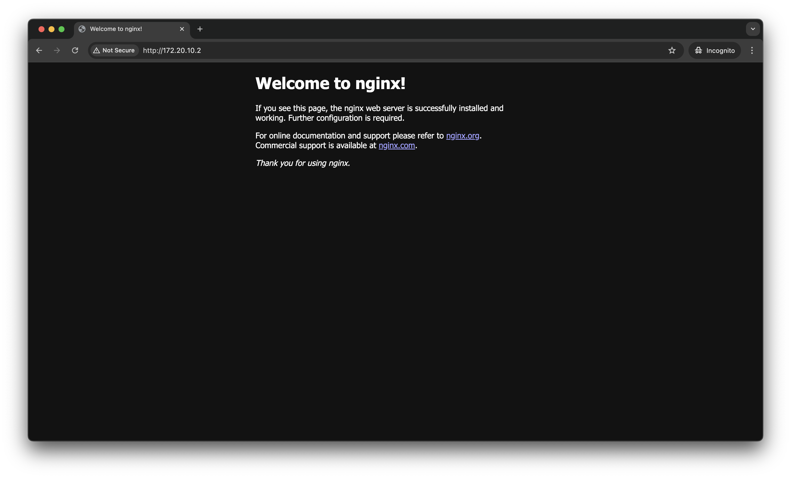
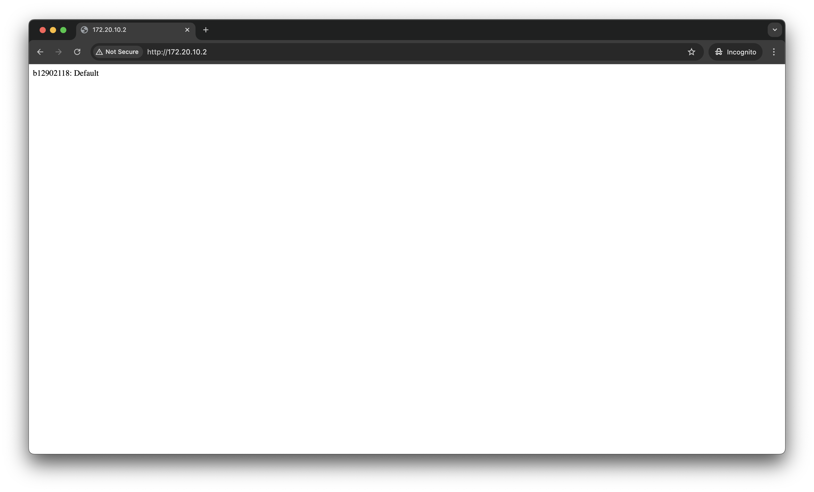
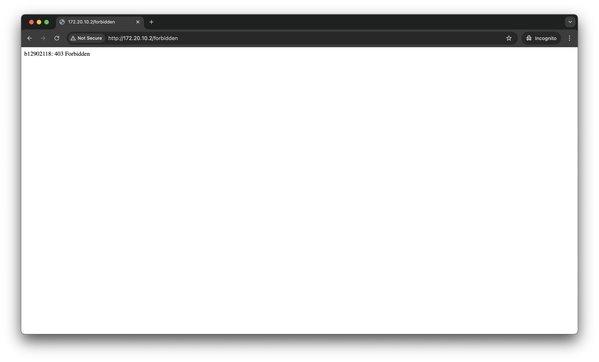
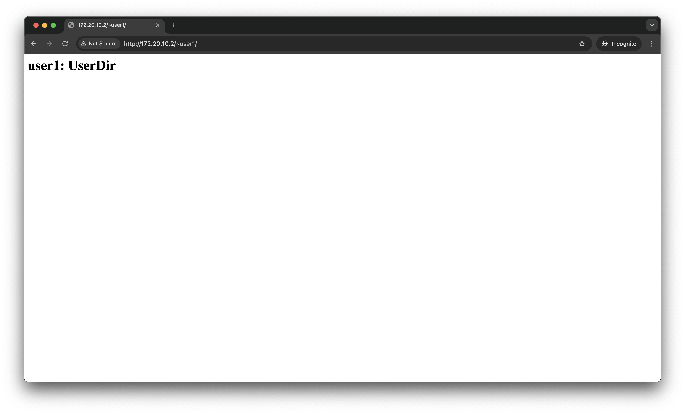
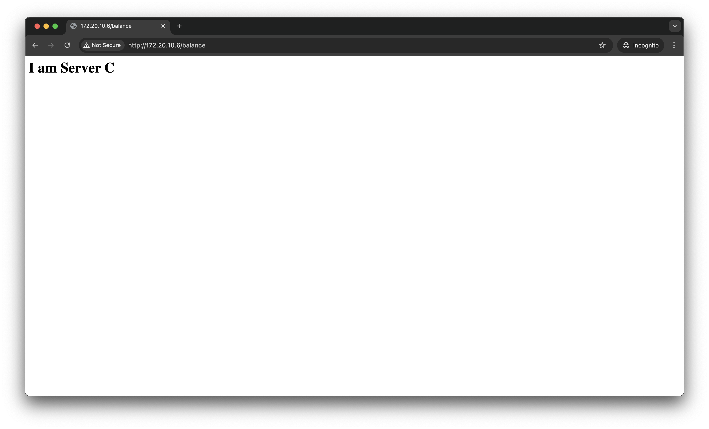

# NASA HW6 - 金哲安(B12902118)
## 1
### References 
- B12902116 (林靖昀)
- B12902066 (宋和峻)
- 2025 Web程式設計與應用（CSIE5210）Django_01_Enviroment.pdf
- https://www.pressplay.cc/project/F720CEB1D6057D7ABB5614722AB18FFF/articles/660A57208C29FF94453548ED21F284EF
- https://medium.com/@daniel.doody/web-servers-a-high-level-overview-of-nginx-vs-apache-ba87f923c024
- https://docs.nginx.com/nginx/admin-guide/basic-functionality/runtime-control/
- https://nginx.org/en/docs/ngx_core_module.html?#user
- https://www.youtube.com/watch?v=5OqgYSXWYQM
- https://www.youtube.com/watch?v=i-rtxrEz_E8
- https://en.wikipedia.org/wiki/Public_key_infrastructure
- https://en.wikipedia.org/wiki/Automatic_Certificate_Management_Environment
- https://www.google.com/search?q=how+to+request+for+a+certificate+from+CA+using+ACME&sca_esv=9f523915fbd1e455&ei=hVPxZ-myGcD11e8PucrCmAw&ved=0ahUKEwipibrFocGMAxXAevUHHTmlEMMQ4dUDCBA&uact=5&oq=how+to+request+for+a+certificate+from+CA+using+ACME&gs_lp=Egxnd3Mtd2l6LXNlcnAiM2hvdyB0byByZXF1ZXN0IGZvciBhIGNlcnRpZmljYXRlIGZyb20gQ0EgdXNpbmcgQUNNRTIFECEYoAEyBRAhGKABSOwVUNsEWPMTcAF4AJABAJgBwQGgAfkGqgEEMTAuMrgBA8gBAPgBAZgCDKAC_AbCAgoQABiwAxjWBBhHwgIHECEYoAEYCpgDAIgGAZAGCpIHBDEwLjKgB7gvsgcDOS4yuAfyBg&sclient=gws-wiz-serp#fpstate=ive&vld=cid:dc761f31,vid:YZwM3hN9Sec,st:0
- https://www.ssl.com/zh-TW/%E6%96%87%E7%AB%A0/%E4%BB%80%E9%BA%BC%E6%98%AF-Acme-%E5%8D%94%E8%AD%B0/
- https://letsencrypt.org/how-it-works/
- https://www.quora.com/Why-do-SSL-certificates-need-to-specify-a-domain-name
- https://en.wikipedia.org/wiki/Domain-validated_certificate
- https://en.wikipedia.org/wiki/Virtual_hosting
- https://www.f5.com/glossary/ssl-termination
- https://docs.nginx.com/nginx/admin-guide/security-controls/terminating-ssl-http/
### 1
#### (a)
A static web server is a web server that only provides web documents that are stored on the server, whereas a dynamic web server can dynamically generate web documents on the fly with the help of databases and backend scripts. A dynamic web server can also store contents provided by clients in the database, but a static web server can't.
#### (b)
A forward proxy is a client-side proxy, it sits between a client and the internet. Clients make requests to the forward proxy, which forwards them to external servers. A reverse proxy is a server-side proxy, it sits between the internet and the backend servers. Clients make requests to the reverse proxy, which forwards them to the appropriate internal server.
Advantages of using proxies:
1. Security & Privacy
	- A forward proxy can hide user IP addresses from websites.
	- A reverse proxy can prevent direct access to backend servers, reducing attack risks.
2. Load Balancing & Performance
	- A reverse proxy distributes traffic efficiently across multiple servers, improving uptime and scalability.
3. Access Control & Content Filtering
	- A forward proxy can block access to malicious or restricted sites.
	- A reverse proxy can limit access based on authentication rules.
#### \(c)
Load balancing is a way of dynamically redirecting client requests to multiple backend servers based on their loads. A method of load balancing is DNS load balancing, which DNS records to direct users to different IP addresses and therefore different hosts.
### 2
#### (a)
An event-driven architecture uses a small amount of worker processes to handle multiple connections at the same time. A process-driven architecture spawns a process or a thread for every connection.
#### (b)
The master process is responsible for reading and evaluate configuration files, as well as maintain the worker processes. The worker processes are responsible for processing the requests from clients.
#### \(c)
The default user to run the master process is root. This is because to listen on ports smaller than 1024 (such as 443 and 80) needs root privileges. The default user to run the worker process is configured by the directive `user user [group];` in the configuration file. If none specified, then the user is nobody. This is specified in the official documentation.
### 3
#### (a)
A public key infrastructure (PKI) is a set of roles, policies, hardware, software and procedures needed to create, manage, distribute, use, store and revoke digital certificates and manage public-key encryption. TLS relies on PKI for secure web communication (HTTPS).
#### (b)
The Automatic Certificate Management Environment (ACME) protocol is a communications protocol for automating interactions between certificate authorities and their users' servers, allowing the automated deployment of public key infrastructure at very low cost. It was designed by the Internet Security Research Group (ISRG) for their Let's Encrypt service.

Here are the steps for a client to request for a certificate from a certificate authority.
1. The ACME agent asks the CA what it needs to do in order to prove that it controls the domain.
2. The CA gives the agent a challenge.
3. The agent completes the challenge.
4. The agent constructs a CSR and send it to the CA.
5. The CA verifies the CSR and issues a certidicate.
#### \(c)
Pros:
- Easy to manage and transfer; domain names can bind to any IP
- Supports virtual hosting, where multiples domains share one IP

Cons:
- IP addresses may be dynamic; once IP changes, the certificate needs to be issued again
- Doesn't support virtual hosting
#### (d)
SSL termination refers to the process of decrypting encrypted traffic before passing it along to a web server. Instead of relying upon the web server to do this computationally intensive work, one can use SSL termination to reduce the load on the servers, speed up the process, and allow the web server to focus on its core responsibility of delivering web content.

Add this in the configuration file of nginx:
```
proxy_set_header X-Forwarded-Proto $scheme;
```
Backend servers can use this to recognize an https request:
```
if request.headers["X-Forwarded-Proto"] == "https":
    # Treat as secure connection
```
<div style=page-break-after: always></div>

## 2
### References 
- B12902116 (林靖昀)
- B12902066 (宋和峻)
- https://nginx.org/en/docs/install.html
- https://hackmd.io/@F6INImbsTzOe4izuqqLoWQ/SJyT8PbD2
- https://www.oreilly.com/library/view/learning-continuous-integration/9781788479356/b2790f14-0644-4ab7-b312-796b31e50c4e.xhtml
- https://manpages.ubuntu.com/manpages/trusty/man8/ufw.8.html
- https://linux.die.net/man/1/nmap
- https://nginx.org/en/docs/beginners_guide.html
- https://www.youtube.com/watch?v=9t9Mp0BGnyI&t=1s
- https://linux.die.net/man/1/chmod
- https://linux.die.net/man/1/find
- https://nginx.org/en/docs/http/ngx_http_upstream_module.html
### 1
Install the prerequisites:
```
sudo apt install curl gnupg2 ca-certificates lsb-release debian-archive-keyring
```
Import an official nginx signing key so apt could verify the packages authenticity. Fetch the key:
```
curl https://nginx.org/keys/nginx_signing.key | gpg --dearmor \
    | sudo tee /usr/share/keyrings/nginx-archive-keyring.gpg >/dev/null
```
Verify that the downloaded file contains the proper key:
```
gpg --dry-run --quiet --no-keyring --import --import-options import-show /usr/share/keyrings/nginx-archive-keyring.gpg
```
The output should contain the full fingerprint 573BFD6B3D8FBC641079A6ABABF5BD827BD9BF62 as follows:
```
pub   rsa2048 2011-08-19 [SC] [expires: 2027-05-24]
      573BFD6B3D8FBC641079A6ABABF5BD827BD9BF62
uid                      nginx signing key <signing-key@nginx.com>
```
To set up the apt repository for stable nginx packages, run the following command:
```
echo "deb [signed-by=/usr/share/keyrings/nginx-archive-keyring.gpg] \
http://nginx.org/packages/debian `lsb_release -cs` nginx" \
    | sudo tee /etc/apt/sources.list.d/nginx.list
```
Set up repository pinning to prefer official packages over distribution-provided ones:
```
echo -e "Package: *\nPin: origin nginx.org\nPin: release o=nginx\nPin-Priority: 900\n" \
    | sudo tee /etc/apt/preferences.d/99nginx
```
To install nginx, run the following commands:
```
sudo apt update
sudo apt install nginx
```
To run nginx:
```
nginx
```
For firewall settings:
```
sudo apt-get install ufw
sudo ufw allow 22/tcp
sudo ufw allow 80/tcp
sudo ufw default deny incoming
sudo ufw default allow outgoing
sudo ufw enable
```
Command may disrupt existing ssh connections. Proceed with operation (y|n)? -> `y`
Check settings:
```
sudo ufw status verbose
```
Output:
```
Status: active
Logging: on (low)
Default: deny (incoming), allow (outgoing), disabled (routed)
New profiles: skip

To                         Action      From
--                         ------      ----
22/tcp                     ALLOW IN    Anywhere                  
80/tcp                     ALLOW IN    Anywhere                  
22/tcp (v6)                ALLOW IN    Anywhere (v6)             
80/tcp (v6)                ALLOW IN    Anywhere (v6)             

```


For firewall testing:
```
nmap -p- 172.20.10.2
```
Result:
```
Starting Nmap 7.95 ( https://nmap.org ) at 2025-04-04 21:25 CST
Nmap scan report for 172.20.10.2
Host is up (0.00088s latency).
Not shown: 65533 filtered tcp ports (no-response)
PORT   STATE SERVICE
22/tcp open  ssh
80/tcp open  http

Nmap done: 1 IP address (1 host up) scanned in 2751.78 seconds
```
Also, we can copy the whole server block but change the listening port to any other unoccupied port, then reload nginx. With the firewall enabled, connections from outside will be blocked. With the firewall disabled, connections from outside to the new port will be successful.
### 2
```
mkdir /data
mkdir /data/www
echo "<html><head></head><body>b12902118: Default</body></html>" > /data/www/index.html
```
edit /etc/nginx/conf.d/default.conf and change this block
```
location / {
	root   /usr/share/nginx/html;
	index  index.html index.htm;
}
```
to this:
```
location / {
	root   /data/www;
	index  index.html;
}
```
```
nginx -s reload
```

### 3
```
mkdir /var/www
mkdir /var/www/html
mkdir /var/www/html/forbidden
echo "<html><head></head><body>b12902118: 403 Forbidden</body></html>" > /var/www/html/forbidden/403.html
```
Add this block in /etc/nginx/conf.d/default.conf
```
error_page 403 /403.html;
location = /forbidden {
    return 403;
}

location = /403.html {
    root /var/www/html/forbidden;
}
```
```
nginx -s reload
```

Testing:
```
curl -I http://172.20.10.2/forbidden
```
Result:
```
HTTP/1.1 403 Forbidden
Server: nginx/1.26.3
Date: Fri, 04 Apr 2025 16:32:21 GMT
Content-Type: text/html
Content-Length: 64
Connection: keep-alive
ETag: "67efed30-40"
 
```
### 4
Add this block in /etc/nginx/conf.d/default.conf
```
location ~ ^/~([a-zA-Z0-9_-]+)(/.*)?$ {
    alias /home/$1/htdocs$2;
    index index.html;
    autoindex on;
}
```
```
sudo mkdir -p /etc/skel/htdocs
sudo useradd -m user1
echo "<h1>user1: UserDir</h1>" | sudo tee /home/user1/htdocs/index.html
sudo chown -R user1:user1 /home/user1/htdocs
sudo chmod 755 /home/user1
sudo chmod 755 /home/user1/htdocs
sudo chmod 644 /home/user1/htdocs/index.html
sudo find /home -maxdepth 1 -type d -exec chmod o+x {} \;
nginx -s reload
```

To make sure new users have `htdocs` directory:
```
ls /etc/skel
```
Result:
```
htdocs
```
### 5
Set up 2 Debian virtual machines with nginx running with similar steps from above.
But do
```
echo "<h1>I am Server A</h1>" > /data/www/index.html
```
for sever A and
```
echo "<h1>I am Server B</h1>" > /data/www/index.html
```
for server B.
And change in the config file /etc/nginx/conf.d/default.conf:
```
rewrite ^/serverA /;

location / {
	root   /data/www;
	index  index.html;
}
```
for server A and
```
rewrite ^/serverB /;

location / {
	root   /data/www;
	index  index.html;
}
```
for server B.

On ServerMain, modify /etc/nginx/conf.d/default.conf and add this block:
```
location /serverA {
	proxy_pass http://172.20.10.5;
}

location /serverB {
	proxy_pass http://172.20.10.4;
}
```
Then reload:
```
nginx -s reload
```
Connect to server A:


Connect to server B:


Note: This problem was not done at the same time as the previous problems, so the IP address of ServerMain changed to 172.20.10.6
### 6
Set up 1 more Debian virtual machines with nginx running with similar steps from above.
But do
```
echo "<h1>I am Server C</h1>" > /data/www/index.html
```
instead.
Change /etc/nginx/conf.d/default.conf on servers A, B, and C to:
```
rewrite ^/balance /;

location / {
	root   /data/www;
	index  index.html;
}
```
And on ServerMain, modify /etc/nginx/conf.d/default.conf and add:
```
upstream balance {
    server 172.20.10.5 max_fails=3 fail_timeout=30s;
    server 172.20.10.4 max_fails=3 fail_timeout=30s;
    server 172.20.10.7 backup;
}
```
Outside the server context, and this:
```
location /balance {
	proxy_pass http://balance/;
}
```
inside the server context, then reload each server:
```
nginx -s reload
```
Connect to server A:

Connect to server B:

Connect to server C:
