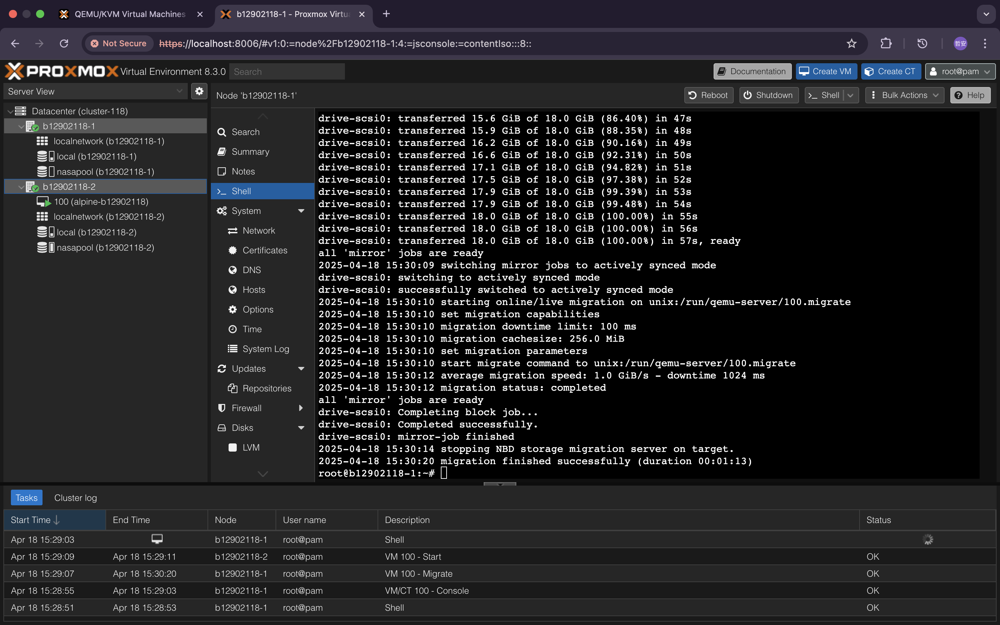

# NASA HW7 - 金哲安(B12902118)

## 1
### References 
- B12902116 (林靖昀)
- B12902066 (宋和峻)
- https://blog.gtwang.org/linux/kvm-qemu-virt-install-command-tutorial/
- https://linux.die.net/man/1/virt-install
- https://pve.proxmox.com/pve-docs/chapter-sysadmin.html
- https://johnliu55.tw/ssh-tunnel.html
### 1
On nasa workstation, get the iso file to the current working directory.
```
cp /tmp2/rabhunter/hw7/proxmox.iso .
```
And then create a virtual disk file.
```
qemu-img create -f qcow2 proxmox.qcow2 10G
```
Install the vm.
```
virt-install --name b12902118-1 \
  --vcpus 2 \
  --ram 8192 \
  --disk proxmox.qcow2,format=qcow2 \
  --network bridge=br0,mac=52:54:90:21:18:01,model=virtio \
  --cdrom=proxmox.iso \
  --os-variant debian11 \
  --boot useserial=on \
  --graphics vnc \
  --noautoconsole
```
And then see which port it is using:
```
virsh vncdisplay b12902118-1
```
It showed:
```
127.0.0.1:0
```
On local computer, create an ssh tunnel:
```
ssh -NL 5900:localhost:5900 b12902118@140.112.91.3
```
On local computer, use vnc viewer to connect to the vm to proceed with the installation. Basically stick with the defaults.
```
vncviewer localhost:5900
```
After finishing installation, start the vm
```
virsh start b12902118-1
```
Check which port it is using and connect to it on local computer. If it hasn't changed then connect to it.
```
vncviewer localhost:5900
```
Log in as root

### 2
Thanks for the kind explanation.
### 3
After login, we can see the ip and port of the web-gui
```
192.168.163.93:8006
```
On local computer, create an ssh tunnel:
```
ssh -NL 8006:192.168.163.93:8006 b12902118@140.112.91.3
```
On local computer, type `localhost:8006` in the browser to connect. And then log in.

<div style=page-break-after: always></div>

## 2
### References 
- B12902116 (林靖昀)
- B12902066 (宋和峻)
- https://linux.die.net/man/1/virsh
- https://wiki.debian.org/ZFS
- https://purevoltage.com/2023/10/05/linux-basics-disk-management-and-partitioning-using-fdisk-mkfs-zfs-df/
- https://docs.redhat.com/en/documentation/red_hat_enterprise_linux/7/html/virtualization_deployment_and_administration_guide/sect-manipulating_the_domain_xml-devices#sect-Network_interfaces-Bridge_to_LAN
- https://forum.proxmox.com/threads/how-to-add-hard-drive-to-host.119376/
### 1
On nasa workstation, create a virtual disk file
```
qemu-img create -f qcow2 proxmox1.qcow2 20G
```
Change the default editor to vim
```
export EDITOR=vim
```
And then edit the configuration file
```
virsh edit b12902118-1
```
Inside the `<devices>`, add a new `<disk>` entry like this
```
<disk type='file' device='disk'>
  <driver name='qemu' type='qcow2'/>
  <source file='/tmp2/b12902118/nasa/HW7/proxmox1.qcow2'/>
  <target dev='vdb' bus='virtio'/>
</disk>
```
Shut down the vm and start it again
```
virsh shutdown b12902118-1
virsh start b12902118-1
```
On the proxmox web page, go to Datacenter > b12902118-1  
On this node, go to Disks > ZFS and click Create: ZFS  
Click the disk /dev/vdb and enter name: nasapool  
Others can be left as default, and click Create
### 2
Edit the configuration file
```
virsh edit b12902118-1
```
Inside the `<devices>` section, add the following:
```
<interface type='user'>
  <model type='virtio'/>
  <mac address='52:54:90:21:18:02'/>
</interface>
```
Shut down the vm and start it again
```
virsh shutdown b12902118-1
virsh start b12902118-1
```
On the vm, check the added interface name:
```
ip a
```
It shows
```
3: enp8s0: <BROADCAST,MULTICAST> mtu 1500 qdisc noop state DOWN group default qlen 1000
    link/ether 52:54:90:21:18:02 brd ff:ff:ff:ff:ff:ff
```
Then request a DHCP lease
```
dhclient enp8s0
```
Then change the default route
```
ip route del default
ip route add default via 10.0.2.2 dev enp8s0
```
### 3
1. Go to the web page of proxmox.  
2. On the left sidebar, expand Datacenter and click b12902118-1.  
3. For this node, click Network.  
4. Click the vmbr0 interface > Edit and remove the gateway.  
5. Click OK.  
6. Click Create > Linux Bridge:
- Name: vmbr1
- IPv4/CIDR: 10.0.2.15/24
- Gateway (IPv4): 10.0.2.2
- Bridge ports: enp8s0

7. Others can be left blank, and then click Apply Configuration.
### 4
1. Download the iso file from /tmp2/rabhunter/hw7/alpine.iso and then upload to proxmox  
2. On the left sidebar: Datacenter > b12902118-1 > local (b12902118-1)  
3. Click ISO images  
4. Click upload  
5. Choose the downloaded iso  
6. Click Create VM  
7. Enter alpine-b12902118 for the Name  
8. Choose the uploaded iso image  
9. Choose nasapool for storage  
10. Disk size 18 GiB  
11. Choose vmbr1 for bridge  
12. Others can be left as default, and then click Check Start after created  
13. After starting alpine, login as root  
14. Run setup-alpine  
- keyboard layout: us  
- keyboard variant: us  
- Hostname: alpine-b12902118  

15. Set up root password  
- Timezone Asia, Taipei  
- Select disk sda for install  
- Use sys mode  

Others can be left as default, and then reboot
### 5
```
adduser b12902118
```
set up a password
### 6

<div style=page-break-after: always></div>

## 3
### References 
- B12902116 (林靖昀)
- B12902066 (宋和峻)
- https://pve.proxmox.com/wiki/Cluster_Manager
- https://pve.proxmox.com/wiki/QEMU/KVM_Virtual_Machines#qm_migration
- https://pve.proxmox.com/pve-docs/chapter-ha-manager.html
### 2
Create two virtual disk files
```
qemu-img create -f qcow2 proxmox2.qcow2 10G
qemu-img create -f qcow2 proxmox3.qcow2 20G
```
Install the vm
```
virt-install --name b12902118-2 \
  --vcpus 2 \
  --ram 8192 \
  --disk proxmox2.qcow2,format=qcow2 \
  --network bridge=br0,mac=52:54:90:21:18:03,model=virtio \
  --cdrom=proxmox.iso \
  --os-variant debian11 \
  --boot useserial=on \
  --graphics vnc \
  --noautoconsole
```
And then see which port it is using:
```
virsh vncdisplay b12902118-2
```
It showed:
```
127.0.0.1:2
```
On local computer, create an ssh tunnel:
```
ssh -NL 5902:localhost:5902 b12902118@140.112.91.3
```
On local computer, use vnc viewer to connect to the vm to proceed with the installation. Basically stick with the defaults.
```
vncviewer localhost:5902
```
After finishing installation, edit the configuration file
```
virsh edit b12902118-2
```
Inside the `<devices>`, add a the following:
```
<disk type='file' device='disk'>
  <driver name='qemu' type='qcow2'/>
  <source file='/tmp2/b12902118/nasa/HW7/proxmox3.qcow2'/>
  <target dev='vdb' bus='virtio'/>
</disk>
<interface type='user'>
  <model type='virtio'/>
  <mac address='52:54:90:21:18:04'/>
</interface>
```
Then start proxmox
```
virsh start b12902118-2
```
Connect through vnc viewer to see the ip and port the web page proxmox is hosting on
```
vncviewer localhost:5902
```
It showed
```
192.168.163.96:8006
```
Create an ssh tunnel
```
ssh -NL 8006:192.168.163.96:8006 b12902118@140.112.91.3
```
On the proxmox web page, go to Datacenter > b12902118-2  
On this node, go to Disks > ZFS and click Create: ZFS  
Click the disk /dev/vdb and enter name: nasapool  
Others can be left as default, and click Create
On the left sidebar, click Network.  
Click the vmbr0 interface > Edit and remove the gateway.  
Click OK.  
Click Create > Linux Bridge:
- Name: vmbr1
- IPv4/CIDR: 10.0.2.15/24
- Gateway (IPv4): 10.0.2.2
- Bridge ports: enp7s0

Others can be left blank.  
Click Apply Configuration.

### 3
To connect to the web gui's of both proxmoxes, create the ssh tunnnels must use different ports. Stop previous tunnels and use these:
```
ssh -NL 8006:192.168.163.93:8006 b12902118@140.112.91.3
ssh -NL 8007:192.168.163.96:8006 b12902118@140.112.91.3
```
Then, log in to pve1 and pve2 via ssh.  
On pve1, create a cluster
```
pvecm create cluster-118
```
On pve2, join the cluster
```
pvecm add 192.168.163.93
```

### 4
1. Remove the iso file first. Go to Datacenter (cluster-118) > b12902118-1 > local (b12902118-1)  
2. Click ISO Images and then click alpine.iso  
3. Click remove  
4. Then go to Datacenter (cluster-118) > b12902118-1 > 100 (alpine-b12902118)  
5. Click Hardware  
6. Click CD/DVD Drive (ide2) 
7. Click Remove  
8. Click Yes  

On pve1, migrate the alpine to pve2
```
qm migrate 100 b12902118-2 --online --with-local-disks
```

### 5
1. Go to Datacenter (cluster-118) > b12902118-2 > 100 (alpine-b12902118)  
2. Click Replication  
3. Click Add  
4. Set Target: b12902118-1  
5. Set Schedule: Every 30 minutes  
6. Others can be left as default, and then click Create  

### 6
1. Go to Datacenter (cluster-118)  
2. Click HA  
3. Click Groups  
4. Click Create  
5. Set ID: group-b12902118  
6. Check both nodes: b12902118-1, b12902118-2  
7. Others can be left as default, and then click Create

### 7
1. Go to Datacenter (cluster-118) > b12902118-2 > 100 (alpine-b12902118)  
2. Click More  
3. Click Manage HA  
4. Set Group: group-b12902118  
5. Others can be left as default, and then click Create  

