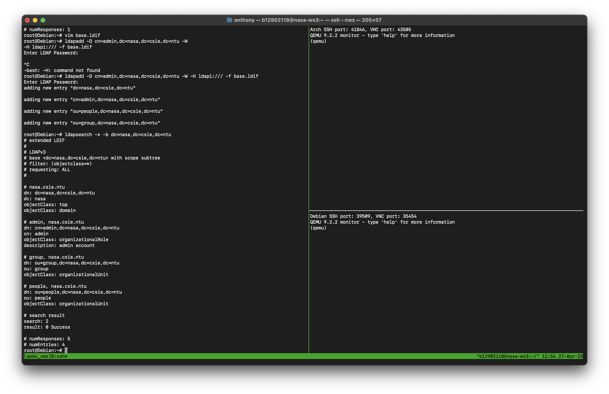
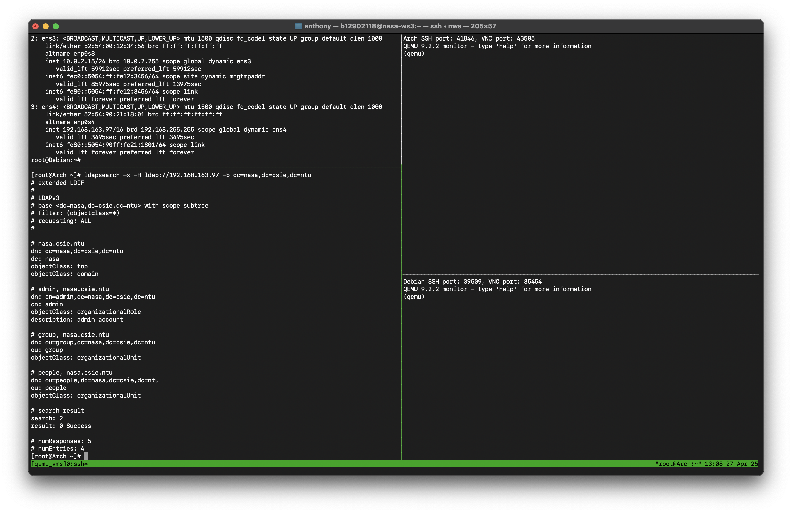
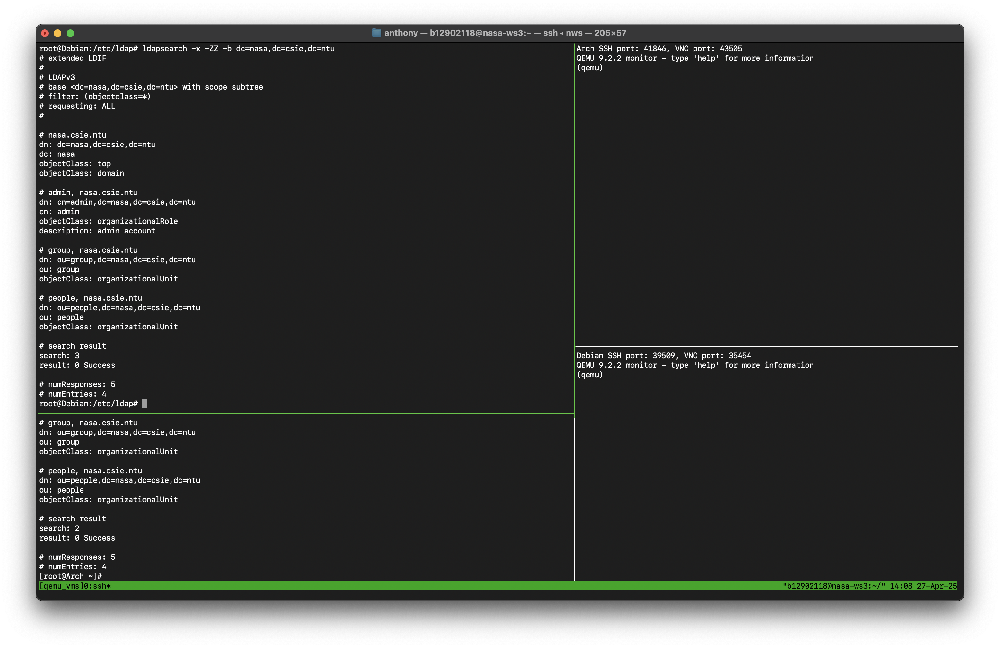
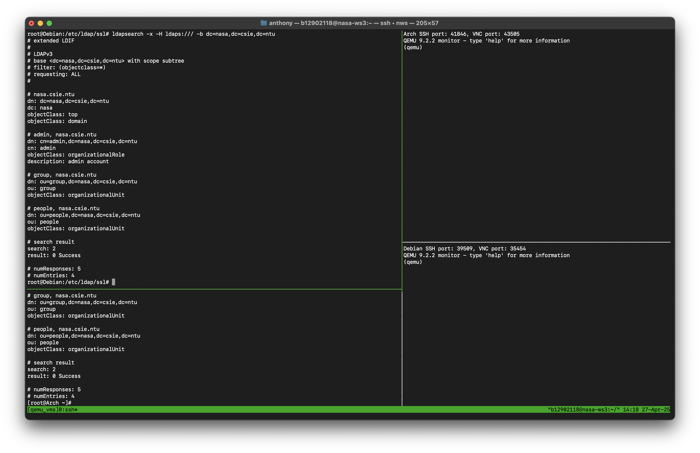
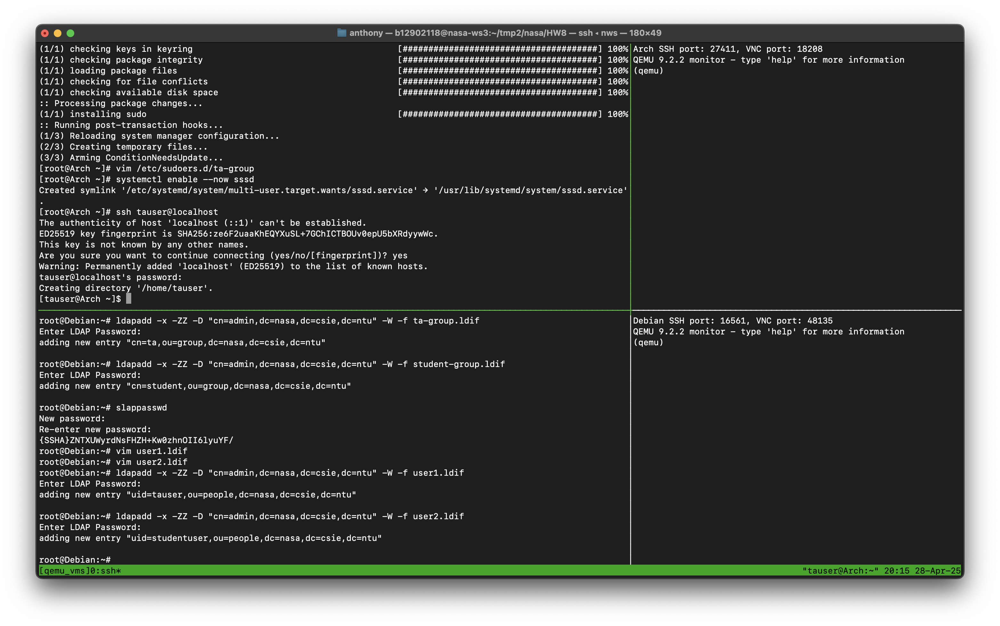

# NASA HW8 - 金哲安(B12902118)

## 前置作業
### References
- B12902116 (林靖昀)
- B12902066 (宋和峻)
- https://docs.google.com/presentation/d/1QOBSuBnh2F55daXRpcfpHbN-fNiUS3Hz2edsyFqzFQQ/edit#slide=id.g32f3cf8fa06_0_0
- https://www.youtube.com/watch?v=WSx7-odbd4Y
### 1
ssh into Debian
```
ssh -p [port] root@localhost
```
Install OpenLDAP and Utilities and editor
```
apt update
apt install slapd ldap-utils ldapvi
```
Set the admin password when the prompt shows up during installation
Configure LDAP DC Suffix
```
# suffix.ldif
dn: olcDatabase={1}mdb,cn=config
changetype: modify
replace: olcSuffix
olcSuffix: dc=nasa,dc=csie,dc=ntu
```
Apply modification
```
ldapmodify -Y EXTERNAL -H ldapi:/// -f suffix.ldif
```
Configure LDAP Root DN
```
# rootdn.ldif
dn: olcDatabase={1}mdb,cn=config
changetype: modify
replace: olcRootDN
olcRootDN: cn=admin,dc=nasa,dc=csie,dc=ntu
```
Apply modification
```
ldapmodify -Y EXTERNAL -H ldapi:/// -f rootdn.ldif
```
Configure LDAP Base Records
```
# base.ldif
dn: dc=nasa,dc=csie,dc=ntu
dc: nasa
objectClass: top
objectClass: domain

dn: cn=admin,dc=nasa,dc=csie,dc=ntu
cn: admin
objectClass: organizationalRole
description: admin account

dn: ou=people,dc=nasa,dc=csie,dc=ntu
ou: people
objectClass: organizationalUnit

dn: ou=group,dc=nasa,dc=csie,dc=ntu
ou: group
objectClass: organizationalUnit
```
Apply modification
```
ldapadd -D cn=admin,dc=nasa,dc=csie,dc=ntu -W -H ldapi:/// -f base.ldif
```
Search
```
ldapsearch -x -b dc=nasa,dc=csie,dc=ntu
```

### 2
Lookup the ip on Debian:
```
ip a
```
There is
```
192.168.163.97
```
ssh into Arch
```
ssh -p [port] root@localhost
```
Install LDAP tools
```
pacman -Syu
pacman -Syu openldap
```
Search
```
ldapsearch -x -H ldap://192.168.163.97 -b dc=nasa,dc=csie,dc=ntu
```

<div style=page-break-after: always></div>

## Task
### References
- B12902116 (林靖昀)
- B12902066 (宋和峻)
- https://www.openldap.org/doc/admin26/OpenLDAP-Admin-Guide.pdf
- https://en.wikipedia.org/wiki/Lightweight_Directory_Access_Protocol
- https://www.youtube.com/watch?v=SK8Yw-CiRHk
- https://www.youtube.com/watch?v=Xjpi8xYqPcY&t=97s
- https://www.youtube.com/watch?v=lp5z8HQGAH8
- https://docs.redhat.com/en/documentation/red_hat_enterprise_linux/7/html/system-level_authentication_guide/configuring_services#Configuring_Services
### 1
Create a certificate on Debian
```
mkdir /etc/ldap/ssl
cd /etc/ldap/ssl
openssl req -new -x509 -nodes -out ldapserver.crt -keyout ldapserver.key -days 365
```
Insert information during prompt:
- Common Name: 192.168.163.97
- Others: Anything is fine

Set permissions
```
chmod 600 ldapserver.key
chown openldap:openldap ldapserver.*
```
Tell slapd to use these certificates
```
# certs.ldif
dn: cn=config
changetype: modify
add: olcTLSCertificateFile
olcTLSCertificateFile: /etc/ldap/ssl/ldapserver.crt
-
add: olcTLSCertificateKeyFile
olcTLSCertificateKeyFile: /etc/ldap/ssl/ldapserver.key
```
Apply modification
```
ldapmodify -Y EXTERNAL -H ldapi:/// -f certs.ldif
```
Modify `/etc/default/slapd` and replace `SLAPD_SERVICES` as
```
SLAPD_SERVICES="ldap:/// ldaps:/// ldapi:///"
```
Restart slapd
```
systemctl restart slapd
```
Allow client to not verify Server
```
echo "TLS_REQCERT allow" >> /etc/ldap/ldap.conf
```
Test
```
ldapsearch -x -ZZ -b dc=nasa,dc=csie,dc=ntu
```

```
ldapsearch -x -H ldaps:/// -b dc=nasa,dc=csie,dc=ntu
```

Limit connections to StartTLS/LDAPS
```
# tls.ldif
dn: cn=config
changetype: modify
replace: olcSecurity
olcSecurity: tls=1
```
Apply modification
```
ldapmodify -Y EXTERNAL -H ldapi:/// -f tls.ldif
```
Restart slapd
```
systemctl restart slapd
```
Go to client and test
```
ldapsearch -x -H ldaps://192.168.163.97 -b dc=nasa,dc=csie,dc=ntu
```
However at this point, it shows this error
```
ldap_sasl_bind(SIMPLE): Can't contact LDAP server (-1)
```
So try create our own CA for the server and sign the certificate for it
Install gnutls-bin
```
apt install gnutls-bin
```
On the server, create a CA private key
```
certtool --generate-privkey --outfile ca-key.pem
```
Create a CA certificate
```
certtool --generate-self-signed --load-privkey ca-key.pem --outfile ca-cert.pem
```
- The certificate will expire in (days): 365
- Does the certificate belong to an authority? (y/N): y 
- Path length constraint (decimal, -1 for no constraint): -1 
- Others can be left as default

Create a server certificate
```
certtool --generate-privkey --outfile server-key.pem
```
Create a CSR template
```
# server-template.cfg
organization = "NASA LDAP"
cn = "192.168.163.97"
tls_www_server
encryption_key
signing_key
expiration_days = 365
```
Use the CA to sign the server's certificate
```
certtool --generate-certificate \
  --load-privkey server-key.pem \
  --load-ca-certificate ca-cert.pem \
  --load-ca-privkey ca-key.pem \
  --template server-template.cfg \
  --outfile server-cert.pem
```
Install the keys and the certificates to OpenLDAP
```
mkdir -p /etc/ldap/certs
cp ca-cert.pem server-cert.pem server-key.pem /etc/ldap/certs/
chmod 600 /etc/ldap/certs/*
chown openldap:openldap /etc/ldap/certs/*
```
Modify config
```
# newcerts.ldif
dn: cn=config
changetype: modify
replace: olcTLSCACertificateFile
olcTLSCACertificateFile: /etc/ldap/certs/ca-cert.pem
-
replace: olcTLSCertificateFile
olcTLSCertificateFile: /etc/ldap/certs/server-cert.pem
-
replace: olcTLSCertificateKeyFile
olcTLSCertificateKeyFile: /etc/ldap/certs/server-key.pem
```
Temporarily remove limitations on connections to StartTLS/LDAPS
Apply modification
```
ldapmodify -Y EXTERNAL -H ldapi:/// -f newcerts.ldif
```
Restore limitations on connections to StartTLS/LDAPS
Restart slapd
```
systemctl restart slapd
```
On the client, configure trusted CA
```
mkdir -p /etc/ssl/certs/myldap
scp root@192.168.163.97:/etc/ldap/certs/ca-cert.pem /etc/ssl/certs/myldap/
```
Modify `/etc/openldap/ldap.conf`
```
TLS_CACERT /etc/ssl/certs/myldap/ca-cert.pem
```
Finally, test
```
ldapsearch -x -H ldaps://192.168.163.97 -b dc=nasa,dc=csie,dc=ntu
```

### 2
On the server, use ldapadd to add two groups
```
# ta-group.ldif
dn: cn=ta,ou=group,dc=nasa,dc=csie,dc=ntu
objectClass: posixGroup
cn: ta
gidNumber: 2000
memberUid: tauser
```
```
# student-group.ldif
dn: cn=student,ou=group,dc=nasa,dc=csie,dc=ntu
objectClass: posixGroup
cn: student
gidNumber: 2001
memberUid: studentuser
```
Apply modifications
```
ldapadd -x -ZZ -D "cn=admin,dc=nasa,dc=csie,dc=ntu" -W -f ta-group.ldif
ldapadd -x -ZZ -D "cn=admin,dc=nasa,dc=csie,dc=ntu" -W -f student-group.ldif
```
Create two passwords for two users and copy them using slappasswd
```
slappasswd
```
Create two users
```
# user1.ldif
dn: uid=tauser,ou=people,dc=nasa,dc=csie,dc=ntu
objectClass: inetOrgPerson
objectClass: posixAccount
objectClass: shadowAccount
uid: tauser
sn: User
givenName: TA
cn: TA User
displayName: TA User
uidNumber: 3000
gidNumber: 2000
homeDirectory: /home/tauser
loginShell: /bin/bash
userPassword: # Paste the created password for the first user here
```
```
# user2.ldif
dn: uid=studentuser,ou=people,dc=nasa,dc=csie,dc=ntu
objectClass: inetOrgPerson
objectClass: posixAccount
objectClass: shadowAccount
uid: studentuser
sn: User
givenName: Student
cn: Student User
displayName: Student User
uidNumber: 3001
gidNumber: 2001
homeDirectory: /home/studentuser
loginShell: /bin/bash
userPassword: # Paste the created password for the second user here
```
Apply modifications
```
ldapadd -x -ZZ -D "cn=admin,dc=nasa,dc=csie,dc=ntu" -W -f user1.ldif
ldapadd -x -ZZ -D "cn=admin,dc=nasa,dc=csie,dc=ntu" -W -f user2.ldif
```
On the client, install SSSD
```
pacman -Syu sssd
```
Set up SSSD
```
# /etc/sssd/sssd.conf
[sssd]
config_file_version = 2
services = nss, pam
domains = LDAP

[domain/LDAP]
cache_credentials = true
enumerate = true

id_provider = ldap
auth_provider = ldap

ldap_uri = ldap://192.168.163.97
ldap_search_base = dc=nasa,dc=csie,dc=ntu
ldap_id_use_start_tls = true
ldap_tls_reqcert = demand
# ldap_tls_cacert = /etc/openldap/certs/cacerts.pem
chpass_provider = ldap
ldap_chpass_uri = ldap://192.168.163.97
entry_cache_timeout = 600
ldap_network_timeout = 2

# OpenLDAP supports posixGroup, uncomment the following two lines
# to get group membership support (and comment the other conflicting parameters)
ldap_schema = rfc2307
ldap_group_member = memberUid

# Other LDAP servers may support this instead
# ldap_schema = rfc2307bis
# ldap_group_member = uniqueMember
```
Set permissions
```
chmod 600 /etc/sssd/sssd.conf
```
Start sssd
```
systemctl enable --now sssd
```
Install PAM
```
pacman -S pambase
```
Add this line in `/etc/pam.d/common-session`
```
session required pam_mkhomedir.so skel=/etc/skel umask=0022
```
Create directory `/etc/sudoers.d`
```
mkdir /etc/sudoers.d
```
Add this line in `/etc/sudoers.d/ta-group`
```
%ta ALL=(ALL) ALL
```
Test
```
ssh tauser@192.168.163.97
sudo echo Hello World
```

```
ssh studentuser@192.168.163.97
sudo echo Hello World
```

{SSHA}fNZqulgJ7qjlN1vVhmgQdJS3f147RWdG
ldapmodify -x -ZZ -D "cn=admin,dc=nasa,dc=csie,dc=ntu" -W -f user1mod.ldif
ldapmodify -x -ZZ -D "cn=admin,dc=nasa,dc=csie,dc=ntu" -W -f user2mod.ldif
### 3

#### 1

#### 2

#### 3
### 4

#### 1

#### 2

#### 3

#### 4
