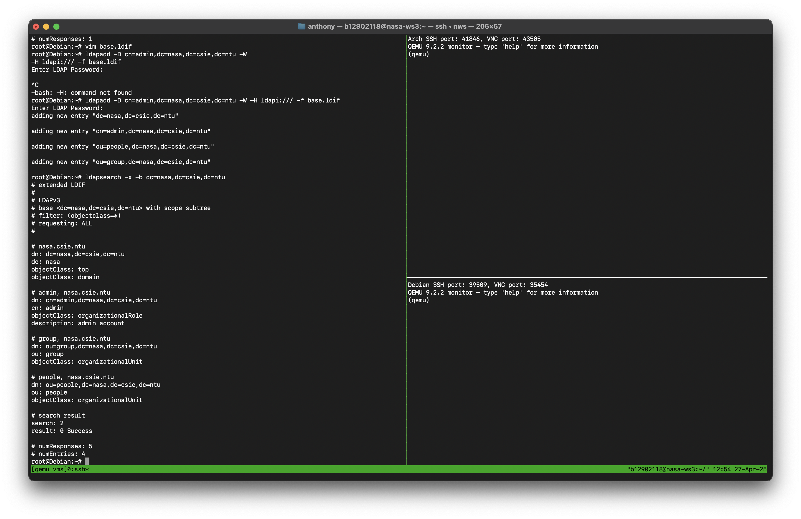
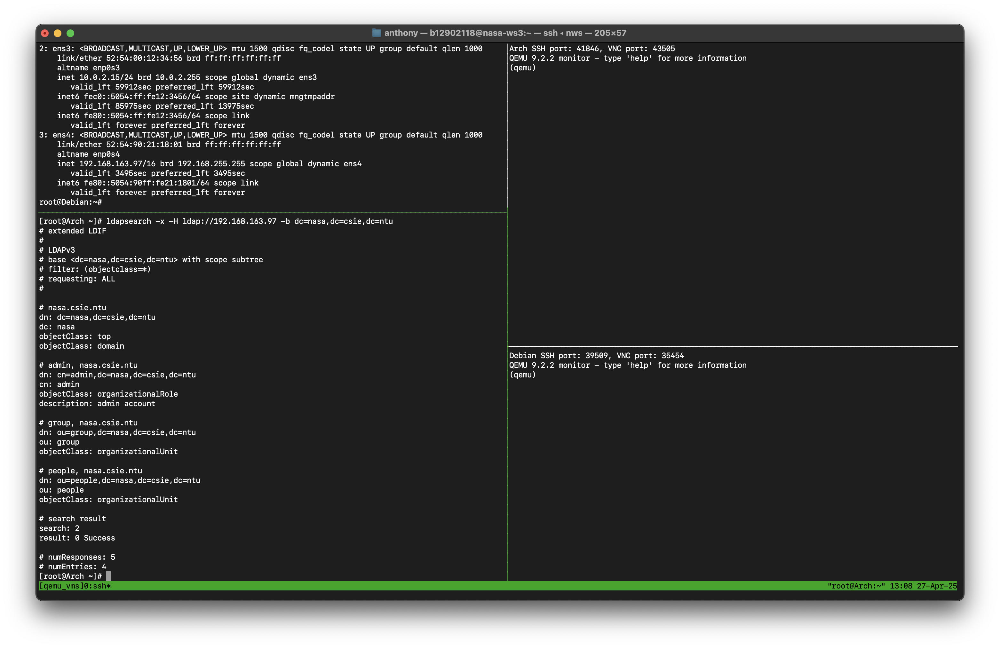
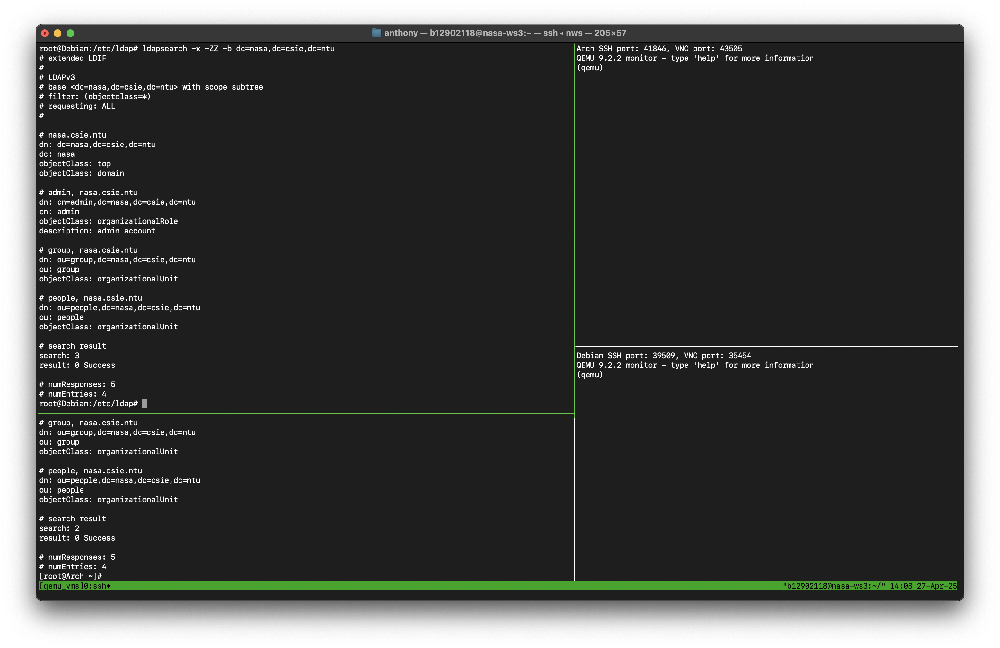
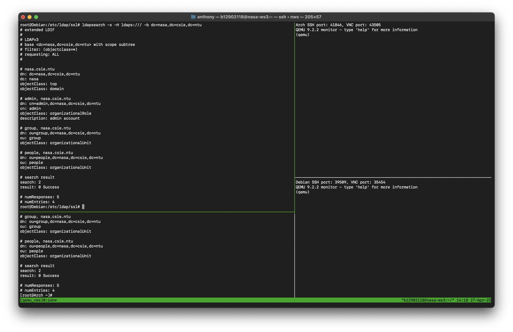
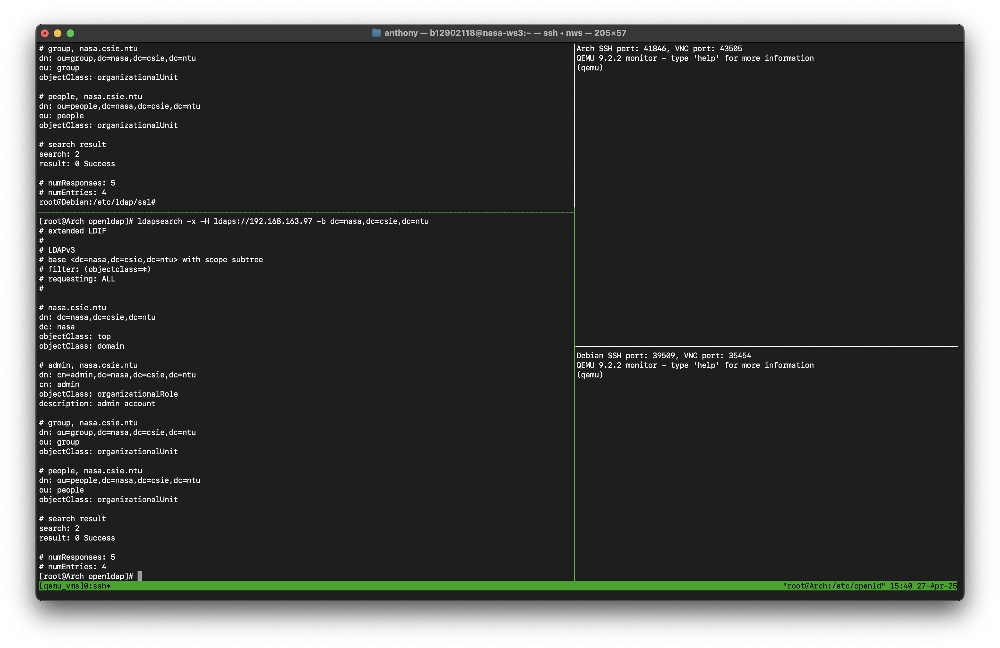
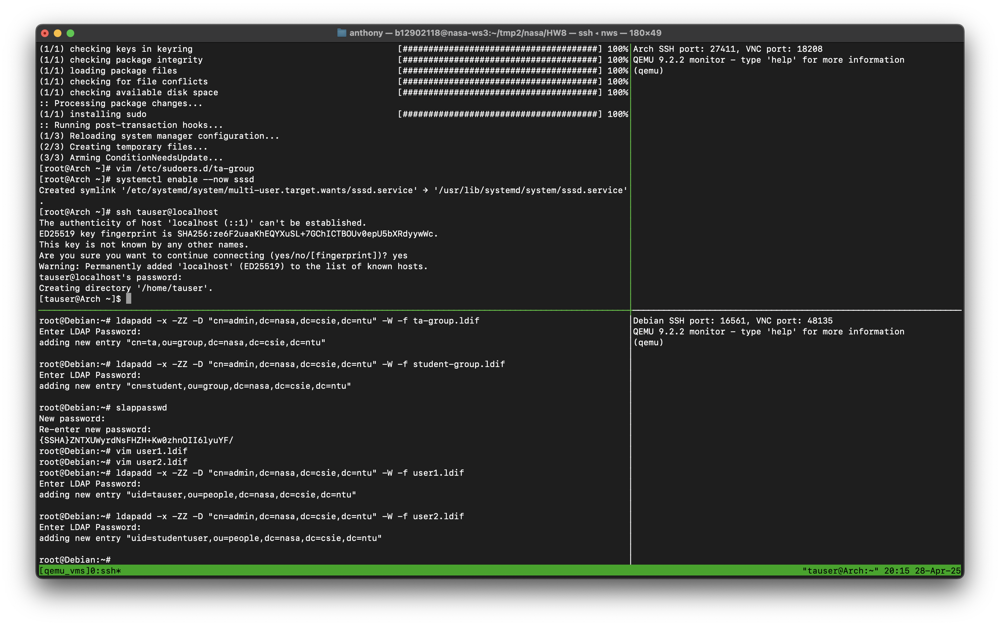
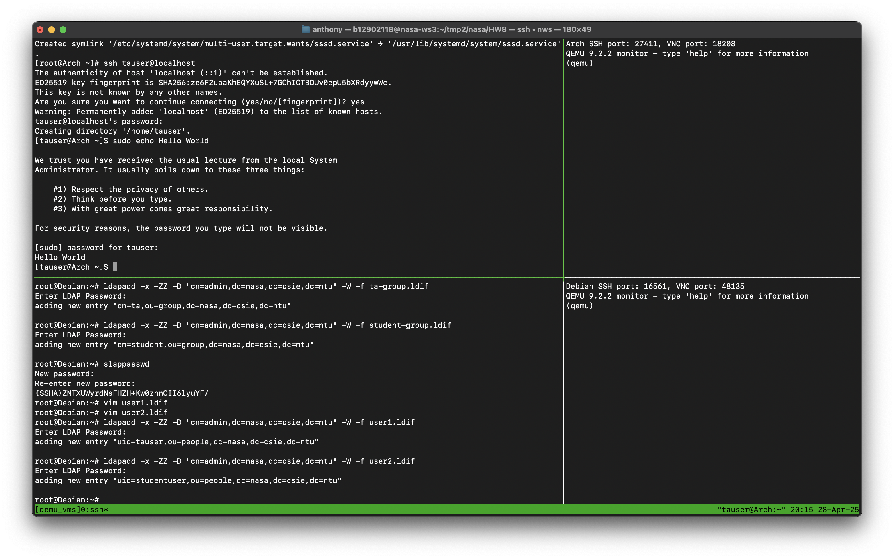
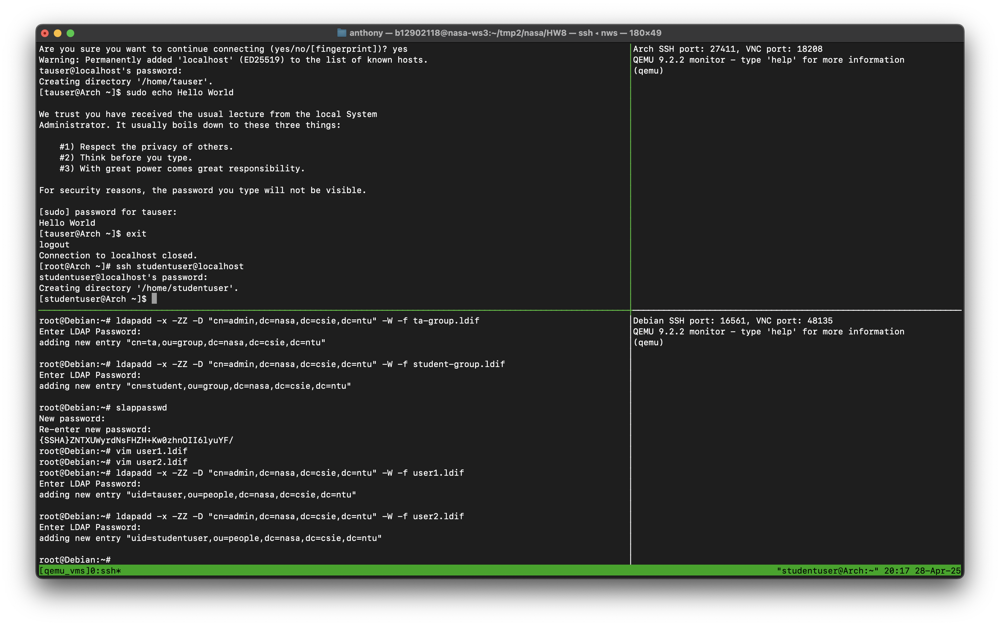
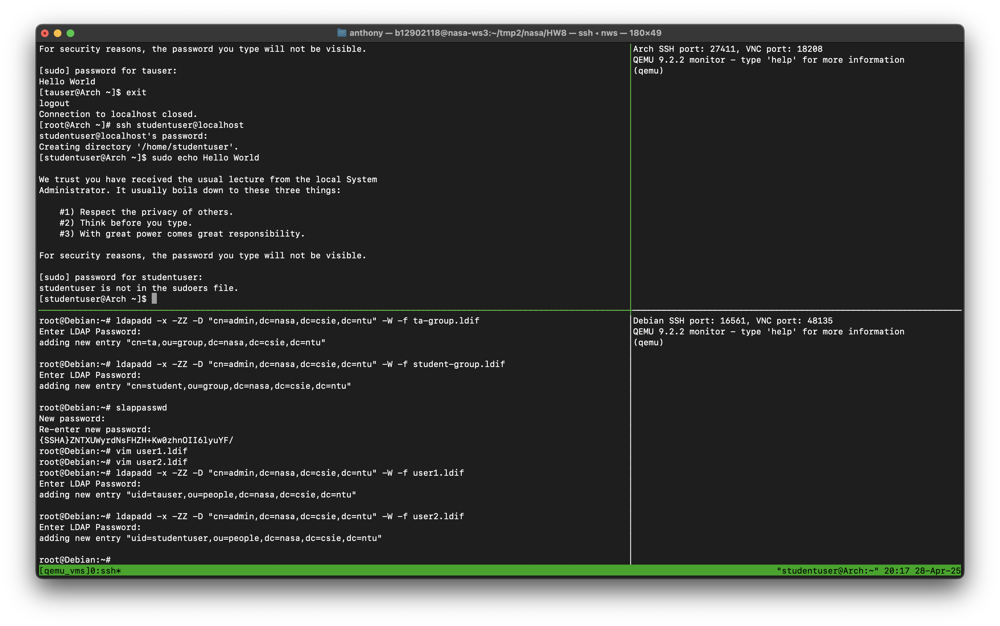
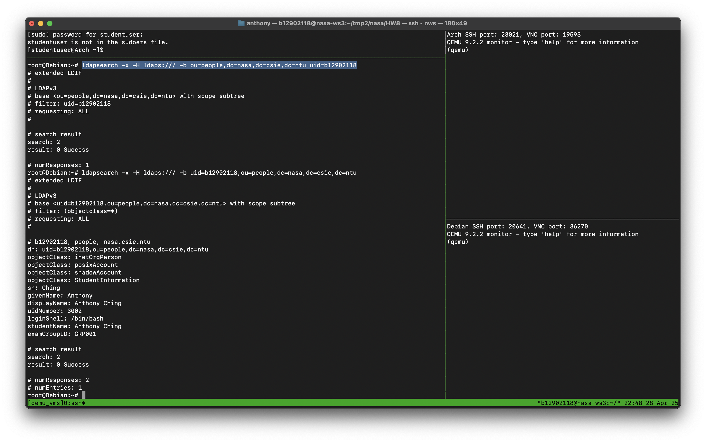

# NASA HW8 - 金哲安(B12902118)
<style>
  code {
    white-space : pre-wrap !important;
    word-break: break-word;
  }
</style>
## 前置作業
### References
- B12902116 (林靖昀)
- B12902066 (宋和峻)
- https://docs.google.com/presentation/d/1QOBSuBnh2F55daXRpcfpHbN-fNiUS3Hz2edsyFqzFQQ/edit#slide=id.g32f3cf8fa06_0_0
- https://www.youtube.com/watch?v=WSx7-odbd4Y
### 1
ssh into Debian
```
ssh -p [port] root@localhost
```
Install OpenLDAP and Utilities and editor
```
apt update
apt install slapd ldap-utils ldapvi
```
Generate a password hash
```
slappasswd
```
Basic Configuration
```
# basic.ldif
dn: olcDatabase={1}mdb,cn=config
changetype: modify
replace: olcSuffix
olcSuffix: dc=nasa,dc=csie,dc=ntu
-
replace: olcRootDN
olcRootDN: cn=admin,dc=nasa,dc=csie,dc=ntu
-
replace: olcRootPW
olcRootPW: {SSHA}8ABxAZ+qNUCbs5pVUmSJMEoYtjBZQQ/J
```
Apply modification
```
ldapmodify -Y EXTERNAL -H ldapi:/// -f basic.ldif
```
Configure LDAP Base Records
```
# base.ldif
dn: dc=nasa,dc=csie,dc=ntu
dc: nasa
objectClass: top
objectClass: domain

dn: cn=admin,dc=nasa,dc=csie,dc=ntu
cn: admin
objectClass: organizationalRole
description: admin account

dn: ou=people,dc=nasa,dc=csie,dc=ntu
ou: people
objectClass: organizationalUnit

dn: ou=group,dc=nasa,dc=csie,dc=ntu
ou: group
objectClass: organizationalUnit
```
Apply modification
```
ldapadd -D cn=admin,dc=nasa,dc=csie,dc=ntu -W -H ldapi:/// -f base.ldif
```
Search
```
ldapsearch -x -b dc=nasa,dc=csie,dc=ntu
```

### 2
Lookup the ip on Debian:
```
ip a
```
There is
```
192.168.163.97
```
ssh into Arch
```
ssh -p [port] root@localhost
```
Install LDAP tools
```
pacman -Syu
pacman -Syu openldap
```
Search
```
ldapsearch -x -H ldap://192.168.163.97 -b dc=nasa,dc=csie,dc=ntu
```

<div style=page-break-after: always></div>

## Task
### References
- B12902116 (林靖昀)
- B12902066 (宋和峻)
- https://www.openldap.org/doc/admin26/OpenLDAP-Admin-Guide.pdf
- https://en.wikipedia.org/wiki/Lightweight_Directory_Access_Protocol
- https://www.youtube.com/watch?v=SK8Yw-CiRHk
- https://www.youtube.com/watch?v=Xjpi8xYqPcY&t=97s
- https://www.youtube.com/watch?v=lp5z8HQGAH8
- https://docs.redhat.com/en/documentation/red_hat_enterprise_linux/7/html/system-level_authentication_guide/configuring_services#Configuring_Services
- https://wiki.archlinux.org/title/LDAP_authentication#Online_and_offline_authentication_with_SSSD
- https://drive.google.com/file/d/12kJLmHz_yVKKd1fn_edC9Bu2LNX3xFw7/view?usp=sharing
### 1
Create a certificate on Debian
```
mkdir /etc/ldap/ssl
cd /etc/ldap/ssl
openssl req -new -x509 -nodes -out ldapserver.crt -keyout ldapserver.key -days 365
```
Insert information during prompt:
- Common Name: Debian
- Others: Anything is fine

Set permissions
```
chmod 600 ldapserver.key
chown openldap:openldap ldapserver.*
```
Tell slapd to use these certificates
```
# certs.ldif
dn: cn=config
changetype: modify
add: olcTLSCertificateFile
olcTLSCertificateFile: /etc/ldap/ssl/ldapserver.crt
-
add: olcTLSCertificateKeyFile
olcTLSCertificateKeyFile: /etc/ldap/ssl/ldapserver.key
```
Apply modification
```
ldapmodify -Y EXTERNAL -H ldapi:/// -f certs.ldif
```
Modify `/etc/default/slapd` and replace `SLAPD_SERVICES` as
```
SLAPD_SERVICES="ldap:/// ldaps:/// ldapi:///"
```
Restart slapd
```
systemctl restart slapd
```
Allow self-signed certificates
```
echo "TLS_REQCERT allow" >> /etc/ldap/ldap.conf
```
Test
```
ldapsearch -x -ZZ -b dc=nasa,dc=csie,dc=ntu
```

```
ldapsearch -x -H ldaps:/// -b dc=nasa,dc=csie,dc=ntu
```

Limit connections to StartTLS/LDAPS
```
# tls.ldif
dn: cn=config
changetype: modify
add: olcLocalSSF
olcLocalSSF: 128
-
add: olcSecurity
olcSecurity: ssf=128
```
Apply modification
```
ldapmodify -Y EXTERNAL -H ldapi:/// -f tls.ldif
```
Restart slapd
```
systemctl restart slapd
```
On the client, also allow self-signed certificates
```
echo "TLS_REQCERT allow" >> /etc/openldap/ldap.conf
```
Test on client
```
ldapsearch -x -H ldaps://192.168.163.97 -b dc=nasa,dc=csie,dc=ntu
```

### 2
On the server, use ldapadd to add two groups
```
# ta-group.ldif
dn: cn=ta,ou=group,dc=nasa,dc=csie,dc=ntu
objectClass: posixGroup
cn: ta
gidNumber: 2000
memberUid: tauser
```
```
# student-group.ldif
dn: cn=student,ou=group,dc=nasa,dc=csie,dc=ntu
objectClass: posixGroup
cn: student
gidNumber: 2001
memberUid: studentuser
```
Apply modifications
```
ldapadd -x -ZZ -D "cn=admin,dc=nasa,dc=csie,dc=ntu" -W -f ta-group.ldif
ldapadd -x -ZZ -D "cn=admin,dc=nasa,dc=csie,dc=ntu" -W -f student-group.ldif
```
Create two passwords for two users and copy them using slappasswd
```
slappasswd
```
Create two users
```
# user1.ldif
dn: uid=tauser,ou=people,dc=nasa,dc=csie,dc=ntu
objectClass: inetOrgPerson
objectClass: posixAccount
objectClass: shadowAccount
uid: tauser
sn: User
givenName: TA
cn: TA User
displayName: TA User
uidNumber: 3000
gidNumber: 2000
homeDirectory: /home/tauser
loginShell: /bin/bash
userPassword: {SSHA}8ABxAZ+qNUCbs5pVUmSJMEoYtjBZQQ/J
```
```
# user2.ldif
dn: uid=studentuser,ou=people,dc=nasa,dc=csie,dc=ntu
objectClass: inetOrgPerson
objectClass: posixAccount
objectClass: shadowAccount
uid: studentuser
sn: User
givenName: Student
cn: Student User
displayName: Student User
uidNumber: 3001
gidNumber: 2001
homeDirectory: /home/studentuser
loginShell: /bin/bash
userPassword: {SSHA}8ABxAZ+qNUCbs5pVUmSJMEoYtjBZQQ/J
```
Apply modifications
```
ldapadd -x -ZZ -D "cn=admin,dc=nasa,dc=csie,dc=ntu" -W -f user1.ldif
ldapadd -x -ZZ -D "cn=admin,dc=nasa,dc=csie,dc=ntu" -W -f user2.ldif
```
On the client, install SSSD
```
pacman -Syu sssd
```
Set up SSSD
```
# /etc/sssd/sssd.conf
[sssd]
config_file_version = 2
services = nss, pam
domains = LDAP

[domain/LDAP]
cache_credentials = true
enumerate = true

id_provider = ldap
auth_provider = ldap

ldap_uri = ldap://192.168.163.97
ldap_search_base = dc=nasa,dc=csie,dc=ntu
ldap_id_use_start_tls = true
ldap_tls_reqcert = allow
chpass_provider = ldap
ldap_chpass_uri = ldap://192.168.163.97
entry_cache_timeout = 600
ldap_network_timeout = 2

# OpenLDAP supports posixGroup, uncomment the following two lines
# to get group membership support (and comment the other conflicting parameters)
ldap_schema = rfc2307
ldap_group_member = memberUid

# Other LDAP servers may support this instead
# ldap_schema = rfc2307bis
# ldap_group_member = uniqueMember
```
Set permissions
```
chmod 600 /etc/sssd/sssd.conf
```
Edit `/etc/nsswitch.conf` as follows
```
# Begin /etc/nsswitch.conf

passwd: files sss
group: files sss
shadow: files sss
sudoers: files sss

publickey: files

hosts: files dns myhostname
networks: files

protocols: files
services: files
ethers: files
rpc: files

netgroup: files

# End /etc/nsswitch.conf
```
Edit `/etc/pam.d/system-auth` as follows
```
#%PAM-1.0

auth sufficient pam_sss.so forward_pass
auth required pam_unix.so try_first_pass nullok
auth optional pam_permit.so
auth required pam_env.so

account [default=bad success=ok user_unknown=ignore authinfo_unavail=ignore] pam_sss.so
account required pam_unix.so
account optional pam_permit.so
account required pam_time.so

password sufficient pam_sss.so
password required pam_unix.so try_first_pass nullok sha512 shadow
password optional pam_permit.so

session     required      pam_mkhomedir.so skel=/etc/skel/ umask=0077
session required pam_limits.so
session required pam_unix.so
session optional pam_sss.so
session optional pam_permit.so
```
Edit `/etc/pam.d/su` as follows
```
#%PAM-1.0
auth            sufficient        pam_rootok.so

auth sufficient   pam_sss.so      forward_pass
auth            required        pam_unix.so

account [default=bad success=ok user_unknown=ignore authinfo_unavail=ignore] pam_sss.so
account         required        pam_unix.so

session         required        pam_unix.so
session optional pam_sss.so
```
Install sudo
```
pacman -Syu sudo
```
Configure sudoers
```
# /etc/sudoers.d/ta-group
%ta ALL=(ALL) ALL
```
Start sssd
```
systemctl enable --now sssd
```
Test
```
ssh tauser@localhost
```

```
sudo echo Hello World
```

Exit out
```
exit
```
Test again
```
ssh studentuser@localhost
```

```
sudo echo Hello World
```

### 3
On the server, create ACL settings
```
# acl.ldif
dn: olcDatabase={1}mdb,cn=config
changetype: modify
replace: olcAccess
olcAccess: {0}to attrs=userPassword
  by self write
  by anonymous auth
  by * none
olcAccess: {1}to attrs=cn,uid,gidNumber,homeDirectory
  by self read
  by * read
olcAccess: {2}to *
  by self write
  by users read
  by anonymous read
```
Apply modifications
```
ldapmodify -Y EXTERNAL -H ldapi:/// -f acl.ldif
```
### 4
Add two new attributes
```
# attr.ldif
dn: cn=schema,cn=config
changetype: modify
add: olcAttributeTypes
olcAttributeTypes: ( 1.3.6.1.4.1.112.6.1 NAME 'studentName' DESC 'Student Full Name' EQUALITY caseIgnoreMatch SYNTAX 1.3.6.1.4.1.1466.115.121.1.15 SINGLE-VALUE )

dn: cn=schema,cn=config
changetype: modify
add: olcAttributeTypes
olcAttributeTypes: ( 1.3.6.1.4.1.112.6.2 NAME 'examGroupID' DESC 'Examination Group ID' EQUALITY caseIgnoreMatch SYNTAX 1.3.6.1.4.1.1466.115.121.1.15 SINGLE-VALUE )
```
Apply modifications
```
ldapmodify -Y EXTERNAL -H ldapi:/// -f attr.ldif
```
Add a new objectClass
```
# obj.ldif
dn: cn=schema,cn=config
changetype: modify
add: olcObjectClasses
olcObjectClasses: ( 1.3.6.1.4.1.112.6.3 NAME 'StudentInformation' DESC 'Student Information Class' SUP top AUXILIARY MUST ( studentName $ examGroupID ) )
```
Apply modifications
```
ldapmodify -Y EXTERNAL -H ldapi:/// -f obj.ldif
```
Create a new password for the new student
```
slappasswd
```
Create a new student
```
# newstudent.ldif
dn: uid=b12902118,ou=people,dc=nasa,dc=csie,dc=ntu
objectClass: inetOrgPerson
objectClass: posixAccount
objectClass: shadowAccount
objectClass: StudentInformation
uid: b12902118
sn: Student
cn: b12902118
uidNumber: 3002
gidNumber: 2001
homeDirectory: /home/b12902118
loginShell: /bin/bash
studentName: Anthony Ching
examGroupID: GRP001
userPassword: {SSHA}8ABxAZ+qNUCbs5pVUmSJMEoYtjBZQQ/J
```
Apply modifications
```
ldapadd -x -ZZ -D "cn=admin,dc=nasa,dc=csie,dc=ntu" -W -f newstudent.ldif
```
Add the new student to the student group
```
# addtogroup.ldif
dn: cn=student,ou=group,dc=nasa,dc=csie,dc=ntu
changetype: modify
add: memberUid
memberUid: b12902118
```
Apply modifications
```
ldapmodify -x -ZZ -D "cn=admin,dc=nasa,dc=csie,dc=ntu" -W -f addtogroup.ldif
```
Test
```
ldapsearch -x -H ldaps:/// -b uid=b12902118,ou=people,dc=nasa,dc=csie,dc=ntu
```



```bash {cmd}
ls .
```

```python {cmd=python3 output=text}
print("This is program")
```