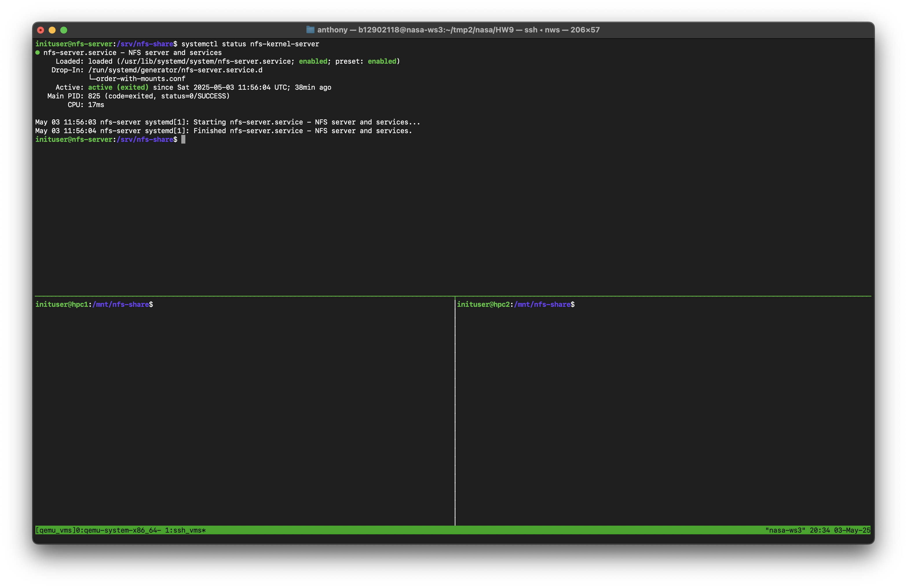
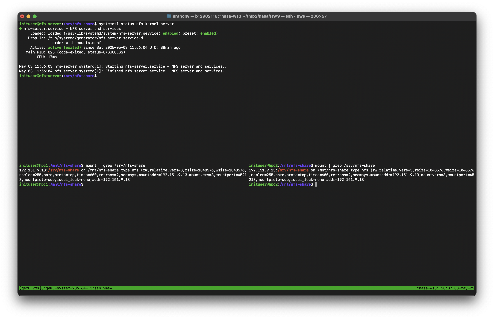
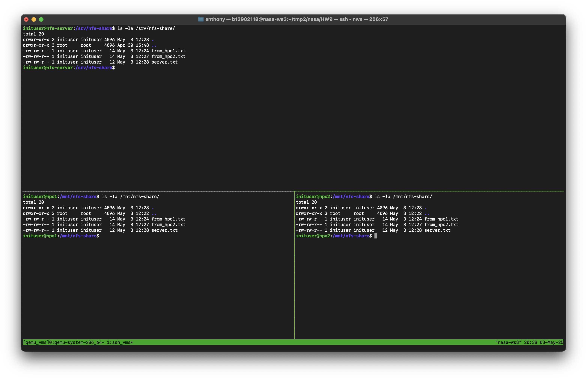
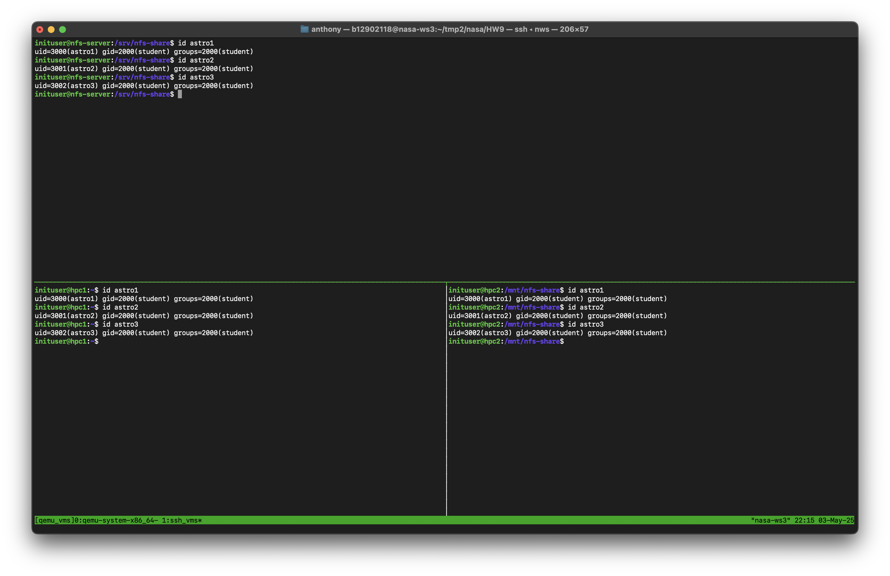
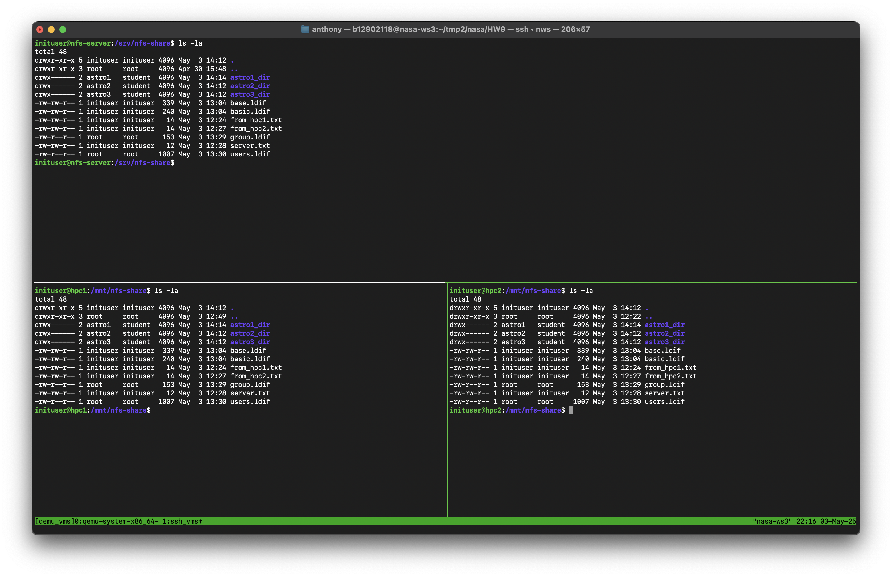
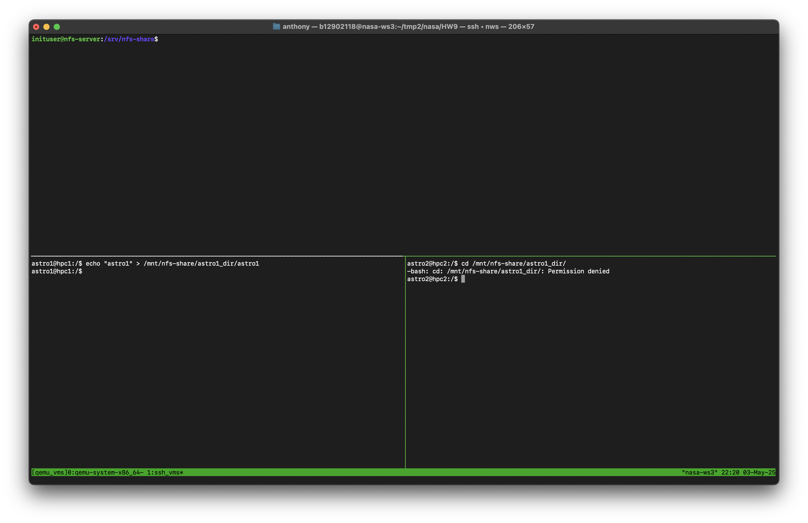
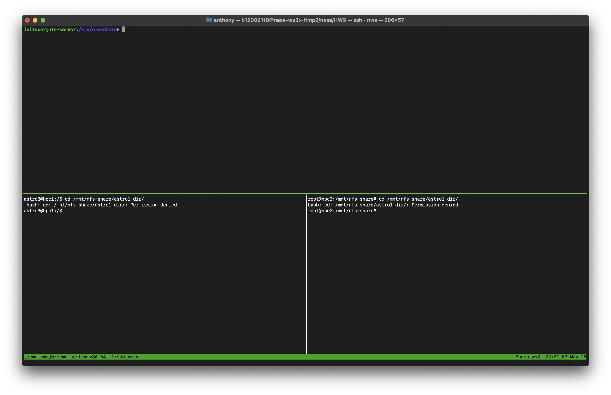

# NASA HW9 - 金哲安(B12902118)

## 第一部分：系統環境與 NFS 基礎安裝 (30pts)
### References
- B12902116 (林靖昀)
- B12902066 (宋和峻)
- https://blog.tigernaxo.com/posts/linux/ubuntu204-static-ip/
- https://docs.google.com/presentation/d/12CehpBWNYFjKwv4hO1BSLZGJz_u0fkogbm1qKortKys/edit#slide=id.g34fc70a50b1_0_31
### Explanation
On the server, modify `/etc/exports`
```
/srv/nfs-share 192.151.9.14(rw,sync,fsid=0,crossmnt,no_subtree_check)    192.151.9.15(rw,sync,fsid=0,crossmnt,no_subtree_check)
```
And then execute
```
sudo chown 1000:1000 /srv/nfs-share
sudo chmod 755 /srv/nfs-share
sudo exportfs -arv 
sudo systemctl enable --now nfs-server
```
Then on each client
```
sudo mkdir -p /mnt/nfs-share
sudo mount -t nfs 192.151.9.13:/srv/nfs-share /mnt/nfs-share
```
### 1

### 2

### 3

<div style=page-break-after: always></div>

## 第二部分：多使用者帳號與權限控管 (30 pts)
### References
- B12902116 (林靖昀)
- B12902066 (宋和峻)
- https://kb.symas.com/reference/configure-ldap-client-on-ubuntu
- https://askubuntu.com/questions/91598/how-do-i-login-as-root
- https://linux.vbird.org/linux_server/centos6/0330nfs.php
### Explanation
On the server, set up ldap
```
# basic.ldif
dn: olcDatabase={1}mdb,cn=config
changetype: modify
replace: olcSuffix
olcSuffix: dc=nasa,dc=csie,dc=ntu
-
replace: olcRootDN
olcRootDN: cn=admin,dc=nasa,dc=csie,dc=ntu
-
replace: olcRootPW
olcRootPW: {SSHA}8ABxAZ+qNUCbs5pVUmSJMEoYtjBZQQ/J
```
Apply modification
```
ldapmodify -Y EXTERNAL -H ldapi:/// -f basic.ldif
```
```
# base.ldif
dn: dc=nasa,dc=csie,dc=ntu
dc: nasa
objectClass: top
objectClass: domain

dn: cn=admin,dc=nasa,dc=csie,dc=ntu
cn: admin
objectClass: organizationalRole
description: admin account

dn: ou=people,dc=nasa,dc=csie,dc=ntu
ou: people
objectClass: organizationalUnit

dn: ou=group,dc=nasa,dc=csie,dc=ntu
ou: group
objectClass: organizationalUni
```
Apply modification
```
ldapadd -D cn=admin,dc=nasa,dc=csie,dc=ntu -W -H ldapi:/// -f base.ldif
```
```
# group.ldif
dn: cn=student,ou=group,dc=nasa,dc=csie,dc=ntu
objectClass: posixGroup
cn: student
gidNumber: 2000
memberUid: astro1
memberUid: astro2
memberUid: astro3
```
Apply modifications
```
ldapadd -D cn=admin,dc=nasa,dc=csie,dc=ntu -W -H ldapi:/// -f group.ldif
```
```
# users.ldif
dn: uid=astro1,ou=people,dc=nasa,dc=csie,dc=ntu
objectClass: inetOrgPerson
objectClass: posixAccount
objectClass: shadowAccount
uid: astro1
sn: astro1
givenName: astro1
cn: astro1
displayName: astro1
uidNumber: 3000
gidNumber: 2000
homeDirectory: /home/astro1
loginShell: /bin/bash
userPassword: {SSHA}LO7clmVNcgkpmFUiAmoynch94nC0o3PY

dn: uid=astro2,ou=people,dc=nasa,dc=csie,dc=ntu
objectClass: inetOrgPerson
objectClass: posixAccount
objectClass: shadowAccount
uid: astro2
sn: astro2
givenName: astro2
cn: astro2
displayName: astro2
uidNumber: 3001
gidNumber: 2000
homeDirectory: /home/astro2
loginShell: /bin/bash
userPassword: {SSHA}LO7clmVNcgkpmFUiAmoynch94nC0o3PY

dn: uid=astro3,ou=people,dc=nasa,dc=csie,dc=ntu
objectClass: inetOrgPerson
objectClass: posixAccount
objectClass: shadowAccount
uid: astro3
sn: astro3
givenName: astro3
cn: astro3
displayName: astro3
uidNumber: 3002
gidNumber: 2000
homeDirectory: /home/astro3
loginShell: /bin/bash
userPassword: {SSHA}LO7clmVNcgkpmFUiAmoynch94nC0o3PY
```
Apply modifications
```
ldapadd -D cn=admin,dc=nasa,dc=csie,dc=ntu -W -H ldapi:/// -f users.ldif
```
On all machines, set up SSSD
```
# /etc/sssd/sssd.conf
[sssd]
config_file_version = 2
services = nss, pam
domains = LDAP

[domain/LDAP]
cache_credentials = true
enumerate = true

id_provider = ldap
auth_provider = ldap

ldap_uri = ldap://192.151.9.13
ldap_search_base = dc=nasa,dc=csie,dc=ntu
chpass_provider = ldap
ldap_chpass_uri = ldap://192.151.9.13
entry_cache_timeout = 600
ldap_network_timeout = 2

# OpenLDAP supports posixGroup, uncomment the following two lines
# to get group membership support (and comment the other conflicting parameters)
ldap_schema = rfc2307
ldap_group_member = memberUid
```
Set permissions
```
chmod 600 /etc/sssd/sssd.conf
```
Edit `/etc/nsswitch.conf` as follows
```
# Begin /etc/nsswitch.conf

passwd: files sss
group: files sss
shadow: files sss
sudoers: files sss

publickey: files

hosts: files dns myhostname
networks: files

protocols: files
services: files
ethers: files
rpc: files

netgroup: files

# End /etc/nsswitch.conf
```
Edit `/etc/pam.d/system-auth` as follows
```
#%PAM-1.0

auth sufficient pam_sss.so forward_pass
auth required pam_unix.so try_first_pass nullok
auth optional pam_permit.so
auth required pam_env.so

account [default=bad success=ok user_unknown=ignore authinfo_unavail=ignore] pam_sss.so
account required pam_unix.so
account optional pam_permit.so
account required pam_time.so

password sufficient pam_sss.so
password required pam_unix.so try_first_pass nullok sha512 shadow
password optional pam_permit.so

session     required      pam_mkhomedir.so skel=/etc/skel/ umask=0077
session required pam_limits.so
session required pam_unix.so
session optional pam_sss.so
session optional pam_permit.so
```
Edit `/etc/pam.d/su` as follows
```
#%PAM-1.0
auth            sufficient        pam_rootok.so

auth sufficient   pam_sss.so      forward_pass
auth            required        pam_unix.so

account [default=bad success=ok user_unknown=ignore authinfo_unavail=ignore] pam_sss.so
account         required        pam_unix.so

session         required        pam_unix.so
session optional pam_sss.so
```
Configure sudoers
```
# /etc/sudoers.d/student-group
%student ALL=(ALL) ALL
```
Start sssd
```
systemctl enable --now sssd
```
On the clients, unmount
```
sudo umount /mnt/nfs-share
```
On the server, modify `/etc/exports`
```
/srv/nfs-share 192.151.9.14(rw,sync,fsid=0,crossmnt,no_subtree_check,root_squash)    192.151.9.15(rw,sync,fsid=0,crossmnt,no_subtree_check,root_squash)
```
And then execute
```
sudo exportfs -arv 
sudo systemctl restart nfs-server
```
Then on the clients, mount again
```
sudo mkdir -p /mnt/nfs-share
sudo mount -t nfs 192.151.9.13:/srv/nfs-share /mnt/nfs-share
```
Then on the server, make the directories
```
sudo mkdir -p /srv/nfs-share/astro1_dir
sudo chmod 700 /srv/nfs-share/astro1_dir
sudo chown -R astro1:student /srv/nfs-share/astro1_dir
```
```
sudo mkdir -p /srv/nfs-share/astro2_dir
sudo chmod 700 /srv/nfs-share/astro2_dir
sudo chown -R astro2:student /srv/nfs-share/astro2_dir
```
```
sudo mkdir -p /srv/nfs-share/astro3_dir
sudo chmod 700 /srv/nfs-share/astro3_dir
sudo chown -R astro3:student /srv/nfs-share/astro3_dir
```
### 1

### 2

### 3


<div style=page-break-after: always></div>

## 第三部分：效能與大規模檔案測試 (40 pts)
### References
- B12902116 (林靖昀)
- B12902066 (宋和峻)
- https://www.man7.org/linux/man-pages/man1/uptime.1.html
- https://blog.csdn.net/tiantianhaoxinqing__/article/details/125956299?fbclid=IwZXh0bgNhZW0CMTEAAR7GiAOx4YAeaOP21aE9ZL8iuC7HO2WtPL8kgUK_QoS7Ha7YVJzyM8dOKr3mow_aem_FbHiktXJoCFzE5A0ynZByg
- https://unix.stackexchange.com/questions/218074/how-to-know-number-of-cores-of-a-system-in-linux
### NFS settings
For each experiment, on the clients, unmount
```
sudo umount /mnt/nfs-share
```
For A and B, modify `/etc/exports`
```
/srv/nfs-share 192.151.9.14(rw,sync,fsid=0,crossmnt,no_subtree_check,root_squash)    192.151.9.15(rw,sync,fsid=0,crossmnt,no_subtree_check,root_squash)
```
For C and D, modify `/etc/exports`
```
/srv/nfs-share 192.151.9.14(rw,async,fsid=0,crossmnt,no_subtree_check,root_squash)    192.151.9.15(rw,async,fsid=0,crossmnt,no_subtree_check,root_squash)
```
And then execute
```
sudo exportfs -arv 
sudo systemctl restart nfs-server
```
Then on the clients, mount again
For A
```
sudo mkdir -p /mnt/nfs-share
sudo mount -t nfs -o sync,rsize=8192,wsize=8192 192.151.9.13:/srv/nfs-share /mnt/nfs-share
```
For B
```
sudo mkdir -p /mnt/nfs-share
sudo mount -t nfs -o sync,rsize=32768,wsize=32768 192.151.9.13:/srv/nfs-share /mnt/nfs-share
```
For C
```
sudo mkdir -p /mnt/nfs-share
sudo mount -t nfs -o async,rsize=8192,wsize=8192 192.151.9.13:/srv/nfs-share /mnt/nfs-share
```
For D
```
sudo mkdir -p /mnt/nfs-share
sudo mount -t nfs -o async,rsize=32768,wsize=32768 192.151.9.13:/srv/nfs-share /mnt/nfs-share
```
### Shell Script
On the server,
```bash
#!/bin/bash
# nfs_test_b12902118.sh
sudo -v

MOUNT_POINT="/mnt/nfs-share"
TESTFILE="$MOUNT_POINT/$(whoami)_dir/$(hostname)"
RESULT_FILE="$MOUNT_POINT/$(whoami)_dir/nfs_test_result_$(hostname)_$(date +%s).txt"


# Function to monitor vmstat during a test and compute averages
monitor_vmstat() {
    local duration_pid=$1
    local log_file=$2

    sleep 0.1
    vmstat 1 > "$log_file" &
    local vm_pid=$!

    wait "$duration_pid"
    kill "$vm_pid" 2>/dev/null
    wait "$vm_pid" 2>/dev/null
}

# Function to extract average CPU usage and load from vmstat log
parse_vmstat_avg() {
    local log_file=$1

    awk '
    NR > 2 {
        load_sum += $1;
        us_sum += $13;
        sy_sum += $14;
        count++;
    }
    END {
        if (count > 0) {
            printf "%.2f\n", (us_sum + sy_sum) / count;
            printf "%.2f\n", load_sum / count;
        } else {
            print "No data collected from vmstat.";
        }
    }' "$log_file"
}

# Function to extract time and speed from dd output
parse_dd_output() {
    local output="$1"
    echo "$output" | grep -Eo '[0-9\.]+ s, [0-9\.]+ MB/s' | awk -F'[ ,]+' '{printf "%s\n%s\n", $1, $3}'
}

# --- Write Test ---

WRITE_VMSTAT_LOG="/tmp/vmstat_write_$(whoami)_$(hostname).log"
WRITE_DD_LOG="/tmp/dd_write_$(whoami)_$(hostname).log"
(dd if=/dev/zero of="$TESTFILE" bs=1M count=1000 conv=fdatasync) &>"$WRITE_DD_LOG" &
WRITE_PID=$!
monitor_vmstat "$WRITE_PID" "$WRITE_VMSTAT_LOG"
wait "$WRITE_PID"

parse_dd_output "$(cat "$WRITE_DD_LOG")" | tee -a "$RESULT_FILE"
parse_vmstat_avg "$WRITE_VMSTAT_LOG" | tee -a "$RESULT_FILE"

# Clear cache
sync; echo 3 | sudo tee /proc/sys/vm/drop_caches > /dev/null

# --- Read Test ---

READ_VMSTAT_LOG="/tmp/vmstat_read_$(whoami)_$(hostname).log"
READ_DD_LOG="/tmp/dd_read_$(whoami)_$(hostname).log"
(dd if="$TESTFILE" of=/dev/null bs=1M count=1000) &>"$READ_DD_LOG"  &
READ_PID=$!
monitor_vmstat "$READ_PID" "$READ_VMSTAT_LOG"
wait "$READ_PID"

parse_dd_output "$(cat "$READ_DD_LOG")" | tee -a "$RESULT_FILE"
parse_vmstat_avg "$READ_VMSTAT_LOG" | tee -a "$RESULT_FILE"

# Cleanup
rm -f "$TESTFILE"
```
Set permissions
```
sudo chmod 755 /srv/nfs-share/nfs_test_b12902118.sh
sudo chown root:root /srv/nfs-share/nfs_test_b12902118.sh
```
This script writes and reads a 1GB file at the nfs mounted directory and uses `dd` to measure the writing and reading times and rates. `vmstat` is used to get the average CPU usage and load. This script does writing, clearing cache, and then reading.
### Results
|測試情境 |寫入時間 (s) |寫入平均傳輸速率 (MB/s) |寫入CPU 使用率 / 負載|讀取時間 (s) |讀取平均傳輸速率 (MB/s) |讀取CPU 使用率 / 負載|
|---|---|---|---|---|---|---|
|參數組合 A + 單一使用者|146.4990|7.20|20.41% / 0.38|21.2678|49.30|78.08% / 1.79|
|參數組合 A + 多使用者|400.2010|2.60|20.13% / 0.39|61.0795|17.18|79.56% / 2.19|
|參數組合 B + 單一使用者| 125.2540 | 8.40 | 9.87% / 0.32 | 18.7597 | 55.90 | 83.05% / 1.53 |
|參數組合 B + 多使用者|406.3197|2.60|11.06% / 0.21|40.8599|25.67|83.75% / 2.33|
|參數組合 C + 單一使用者| 15.1003| 69.40| 69.4% / 1.93| 15.1153| 69.40| 83.80% / 2.27|
|參數組合 C + 多使用者| 73.2524| 17.41| 46.53% / 1.09| 55.90| 18.77| 80.31% / 2.52|
|參數組合 D + 單一使用者| 14.6719| 71.50| 59.60% / 1.07| 19.9957| 52.40| 83.65% / 1.45|
|參數組合 D + 多使用者| 86.6193| 15.35| 56.03% / 0.6417| 60.9878| 17.28| 76.73% / 1.68|
### Answer
Yes, there is an efficiency degrade. I think the reason is because in the multi-user setting, NFS needs to deal with with syncing, all writing requests from clients need to be synchronized, causing overhead. We can adjust server side syncing option to async to improve performance.
