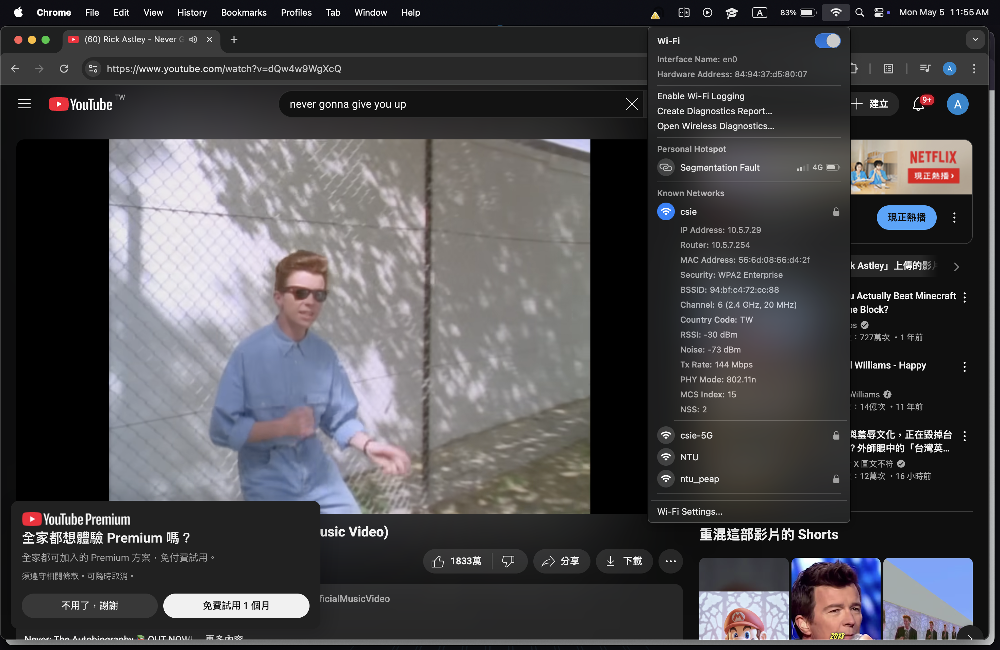

## 2.4GHz
||離 AP 最近點|離 AP 最遠(未隔牆)點|和 AP 隔著牆壁|
|---|---|---|---|
|Signal Strength|-30 dBm|-46 dBm|-61 dBm|
|SNR|43 dB|33 dB|16 dB|
|Transmission Rate|144 Mbps|144 Mbps|115 Mbps|
|Screenshot||||
## 5GHz
||離 AP 最近點|離 AP 最遠(未隔牆)點|和 AP 隔著牆壁|
|---|---|---|---|
|Signal Strength|-33 dBm|-49 dBm|-53 dBm|
|SNR|60 dB|44 dB|40 dB|
|Transmission Rate|866 Mbps|866 Mbps|780 Mbps|
|Screenshot||||

Signal strength is the power level of the radio signal received from the Wi-Fi router. Its unit is dBm, meaning that the signal power is in milliwatts and then taken a decibel.
SNR is the signal-to-noise ratio, it is the difference of signal power and noise power in dBm. Its unit is dB.
Transmission Rate is the amount of data transmitted in a given interval. Its unit is Mbps.

## Answers
For each value, the longer the distance, the smaller the value. This is because signal strength follows the Friis formula. And thus SNR also decrease because SNR = signal strength - noise. Transmission rate also decreases because SNR decreases.
This is consistent with the values I measured.
The signal decay for 2.4G when going behind a wall is less severe than 5G because it has a lower frequency, and it penetrates walls better.
This is inconsistent with my measurements. It might be due to the APs that I connected to in 204 are too close to each other, and while I was moving behind the wall, my computer received signals from another AP.
