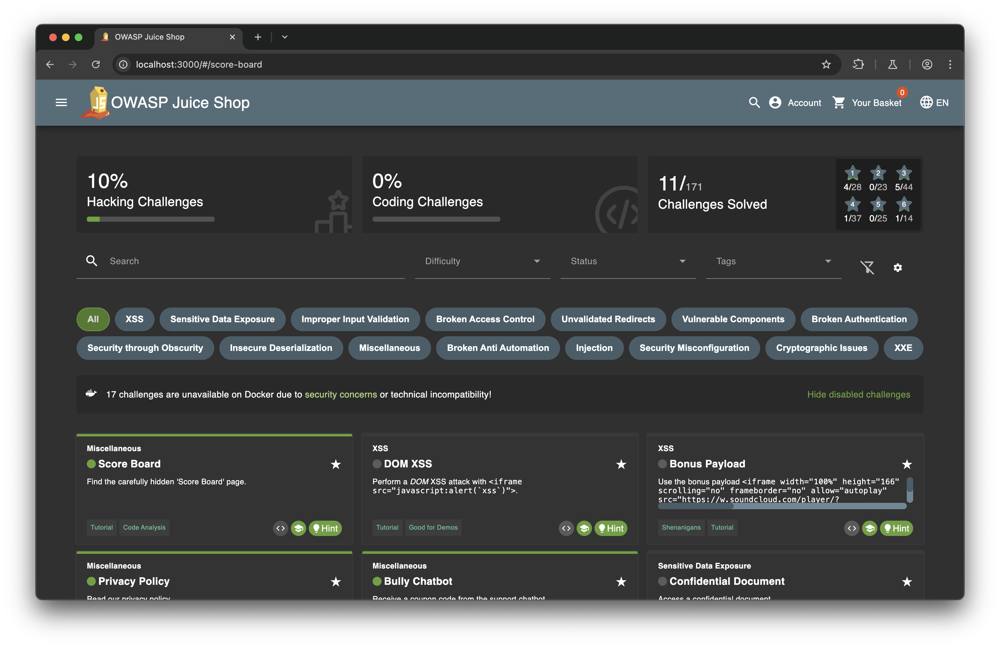

## Score Board

## Forged Review (3)
After logging in, click any product and leave a review. Before submitting, start intercepting on burpsuite. Change the "author" to "admin@juice-sh.op"
## Forged Feedback (3)
After logging in, leave a customer feedback. Change the user id with burpsuite before sending out the packet.
## Admin Registration (3)
First try to register an account and intercept the packet. Add a "admin":true in the payload. We can see that the response payload says "role":"customer" instead. So we register a new account with "role": "admin" in the payload before sending out the packet with burpsuite.
## User Credentials (4)
Turn on interception before logging in. When successfully logging in, there is a packet captured with header 'GET /rest/products/search?q='. Send this packet to repeater and modify it to 'GET /rest/products/search?q=banana', and then send. We can see that the result returned 9 columns. Therefore we can construct a sql injection clause as follows:
banana'))%20UNION%20SELECT%20id,email,password,'4','5','6','7','8','9'%20FROM%20Users--
After sending out this packet, we can get user credentials.
## Login Jim (3)
After getting user credentials from the previous problem, we can see that jim@juice-sh.op has a password hash (description): e541ca7ecf72b8d1286474fc613e5e45
We can go to crackstation.net and paste the hash in and get the password: ncc-1701
Then we can login to Jim's account.
## Login Bender (3)
When logging in, input username as bender@juice-sh.op' --
## Forged Coupon (6)
After bullying chatbot, we get the coupon code. Then buy anything with the coupon code 'o*I]qh7ZKp'.